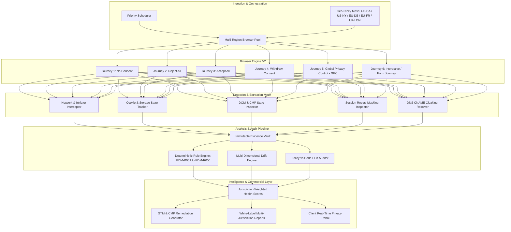
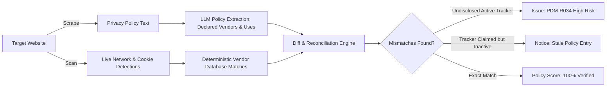
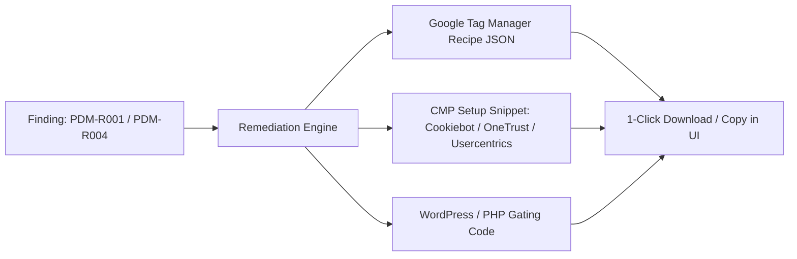

# Privacy Drift Monitor V2 — The Global Enterprise Privacy & Consent Intelligence Platform

> **Next-Generation Automated Privacy, Consent & Tracking Governance for Web Agencies & Global Digital Portfolios**
>
> Builds upon Phase 0–5 baseline to deliver multi-jurisdiction compliance intelligence across **EU (GDPR & ePrivacy / TDDDG / CNIL), UK (ICO / PECR), and US (CCPA / CPRA / FTC Section 5 / CIPA Wiretapping)**.
>
> Version 2.0 · Architectural Specification & Implementation Roadmap

---

## Executive Summary & Vision V2

Privacy Drift Monitor V1 established continuous, deterministic real-browser scanning across four consent journeys (*No Consent, Reject All, Accept All, Withdraw*) with automated drift detection, verified evidence chains, white-label reporting, and agency care plan monetization.

**Privacy Drift Monitor V2** expands the platform from European consent auditing into a **unified global privacy intelligence and enforcement defense engine**. It addresses the exact technical gaps that result in multimillion-dollar fines and class-action lawsuits across Europe, the UK, and North America:

1. **Global Privacy Control (GPC) & US State Law Opt-Out Compliance** (Preventing CCPA / Sephora / Tractor Supply fines).
2. **Multi-Region Geo-Proxy Matrix** (Detecting geo-gated banners and location-dependent tracking behavior).
3. **Privacy Policy vs. Technical Reality Auditor** (Preventing FTC Section 5 "Deceptive Trade Practices" fines by catching undisclosed pixels).
4. **Session Replay & CIPA Wiretap Risk Analyzer** (Defending against class-action lawsuits over Hotjar, FullStory, and Clarity form inputs).
5. **Interactive & Deep-Page Journey Testing** (Detecting trackers fired on form submissions, button clicks, and cart actions).
6. **First-Party CNAME Cloaking & Server-Side Tracking Diagnostics** (Detecting hidden ad-tech masquerading as first-party endpoints).
7. **Automated Remediation & GTM Fix Generator** (Providing copy-paste Google Tag Manager and CMP fix recipes).

---

## System Architecture V2



---

## Part I — Global Regulatory Matrix & Jurisdiction Profiles

V2 introduces **Jurisdiction Profiles**, allowing agencies to evaluate each client website against specific legal benchmarks:

| Jurisdiction | Key Regulations | Enforcement Focus in V2 | Key Rule Implementations |
|---|---|---|---|
| **🇪🇺 EU - Germany Strict** | GDPR, TDDDG §25, LG München Font Ruling | Zero pre-consent tolerance for any non-essential cookie/request (even anonymized analytics); third-party font/CDN blocking; cookie walls prohibited. | `PDM-R001`, `PDM-R002`, `PDM-R020`, `PDM-R026` |
| **🇫🇷 EU - France CNIL** | GDPR, French Data Protection Act | Direct first-layer "Tout refuser" (Reject All) equal sizing; 13-month cookie lifespan limit; 6-month consent refresh; strict CNIL analytics exemption rules. | `PDM-R011`, `PDM-R021`, `PDM-R027` |
| **🇪🇸 EU - Spain AEPD** | GDPR, LSSI-CE | Mandatory visible "Rechazar todo" on first layer; strict two-click transparency; prohibition of deceptive styling. | `PDM-R011`, `PDM-R012` |
| **🇮🇹 EU - Italy Garante** | GDPR, Cookie Guidelines 2021 | Top-right "X" close button must equal rejection; minimum 6-month cooldown before re-prompting; granular category toggles. | `PDM-R028`, `PDM-R029` |
| **🇬🇧 UK - ICO / PECR** | UK GDPR, Data Protection Act 2018, PECR | Strict opt-in for marketing & analytics; equal weight for Reject vs Accept; clear third-party vendor disclosure. | `PDM-R001`, `PDM-R004`, `PDM-R030` |
| **🇺🇸 US - California (CCPA / CPRA)** | Cal. Civ. Code § 1798.100+, CPPA Enforcement | Mandatory respect for **Global Privacy Control (`Sec-GPC: 1`)**; "Do Not Sell/Share My Info" functional link; third-party ad pixel disclosure. | `PDM-R031`, `PDM-R032`, `PDM-R033` |
| **🇺🇸 US - Federal (FTC Act § 5)** | FTC "Unfair or Deceptive Practices" | Pixel tracking contradictions (BetterHelp/GoodRx); tracking sensitive fields; sharing data beyond declared privacy policy scope. | `PDM-R034`, `PDM-R035` |
| **🇺🇸 US - Wiretapping (CIPA / State Laws)** | California CIPA § 631, Pennsylvania Wiretap Act | Session replay scripts (Hotjar, FullStory, Clarity) capturing unmasked form inputs and keystrokes without prior consent. | `PDM-R036`, `PDM-R037` |

---

## Part II — Next-Gen Scanning Architecture V2

### 2.1 Multi-Region Geo-Proxy Mesh
Websites frequently serve different CMPs and tracking scripts depending on the visitor's geographic location. V2 introduces residential and data-center proxy routing per scan:

* **Supported Egress Regions:**
  * `EU-DE` (Frankfurt, Germany — GDPR/TDDDG benchmark)
  * `EU-FR` (Paris, France — CNIL benchmark)
  * `UK-LON` (London, UK — ICO benchmark)
  * `US-CA` (Los Angeles/Silicon Valley, California — CCPA/CPRA benchmark)
  * `US-VA` (Ashburn, US East — Baseline US traffic)
* **Execution:** Scans can run single-region or multi-region comparison scans (`geo_matrix_scan`), comparing what European visitors experience versus US visitors on the same URL.

### 2.2 The 5th Consent Journey: Global Privacy Control (GPC)
Under California CPRA and Colorado CPA, websites must treat browser-level opt-out signals as a valid request to opt out of the sale/sharing of personal data.

* **Playwright Implementation:**
  ```ts
  const context = await browser.newContext({
    extraHTTPHeaders: {
      'Sec-GPC': '1',
      'DNT': '1',
    },
  });
  ```
* **Verification Algorithm:**
  1. Load page with `Sec-GPC: 1` enabled (no user interaction with CMP).
  2. Inspect if the CMP banner automatically shows *"Opt-Out Signal Honored"* or suppresses third-party advertising pixels (Meta, TikTok, Criteo, Google Ads).
  3. If marketing/ad trackers still fire, trigger `PDM-R031: GPC_SIGNAL_IGNORED` (**Critical**).

### 2.3 Interactive & Action Simulator (Journey 6)
Certain scripts load lazily or trigger only upon user interaction:
* **Simulated Behaviors:**
  * **Scroll & Viewport Dwell:** 25%, 50%, 75%, 100% scroll depth with configurable dwell time.
  * **Interactive Element Probing:** Hovering navigation menus, clicking accordion tabs, opening search modals.
  * **Form Field Focus & Entry (Synthetic Dummy Data):** Typing into search bars, newsletter boxes, and contact forms to monitor dynamic keylogger or pixel firing.
  * **Cart & E-Commerce Flow:** Clicking `Add to Cart` on detected Shopify / WooCommerce buttons to verify if cart events fire without consent.

### 2.4 CNAME Cloaking & First-Party Proxy De-Anonymization
Modern ad-tech vendors often bypass browser tracking protection and CMPs by using first-party subdomains (e.g., `metrics.clientwebsite.com` pointing via DNS CNAME to an off-site tracking server like Adobe, Criteo, or Meta).

* **Detection Engine:**
  * For every request to a first-party subdomain, the scanner resolves the full DNS CNAME chain via Node.js `dns.promises.resolveCname`.
  * If `metrics.example.com` $\rightarrow$ `cname.adobe-analytics.com`, the request is classified under the actual third-party vendor.
  * Triggers `PDM-R038: CNAME_CLOAKED_TRACKER_DETECTED`.

---

## Part III — Advanced Detection & Extended Rule Inventory (PDM-R026 – PDM-R050)

In addition to V1's foundation (`PDM-R001`–`PDM-R025`), V2 implements 25 advanced detection rules:

### Extended Rules Inventory

| Rule ID | Category | Name & Trigger Condition | Severity | Regulatory Benchmark |
|---|---|---|---|---|
| **PDM-R026** | `EU_GERMANY` | **Unconsented Analytics under TDDDG §25**<br>Any analytics request or cookie (even first-party/anonymized) firing pre-consent. | **High** | Germany DSK / TDDDG |
| **PDM-R027** | `EU_FRANCE` | **Cookie Retention Exceeds CNIL 13-Month Rule**<br>Non-essential cookie expiration timestamp exceeds 395 days. | **Medium** | France CNIL Deliberation |
| **PDM-R028** | `EU_ITALY` | **Banner Close ("X") Does Not Block Tracking**<br>Clicking top-right banner close element still allows non-essential trackers. | **Critical** | Italy Garante Guidelines |
| **PDM-R029** | `CONSENT_MISSING` | **Cookie Wall / Forcible Gating Detected**<br>Website fully prevents scrolling or content access without explicit consent. | **High** | EDPB Guidelines on Cookie Walls |
| **PDM-R030** | `UK_PECR` | **Unconsented Marketing Tag via GTM Consent Mode Default**<br>GTM tags fire with `ad_storage: granted` before user banner selection. | **Critical** | UK ICO Guidance |
| **PDM-R031** | `US_CCPA` | **Global Privacy Control (GPC) Signal Ignored**<br>Ad/marketing trackers continue firing when `Sec-GPC: 1` header is present. | **Critical** | CCPA / Sephora Enforcement |
| **PDM-R032** | `US_CCPA` | **Missing "Do Not Sell/Share My Personal Information" Link**<br>Page targeting US/California lacks a compliant DNS/GPC opt-out footer control. | **High** | Cal. Civ. Code § 1798.135 |
| **PDM-R033** | `US_CCPA` | **Broken CCPA Opt-Out Preference Center**<br>Selecting opt-out in US preference center fails to suppress downstream ad network tags. | **Critical** | CCPA / Tractor Supply Case |
| **PDM-R034** | `FTC_COMPLIANCE` | **Policy-to-Code Vendor Mismatch (Undisclosed Tracker)**<br>Tracker detected on site that is completely missing from the privacy policy text. | **High** | FTC Act Section 5 |
| **PDM-R035** | `FTC_COMPLIANCE` | **Sensitive Field Data Transmitted to Third Party**<br>Form field inputs (email, password, health query) found in query parameters/payloads to 3P. | **Critical** | FTC BetterHelp / GoodRx Cases |
| **PDM-R036** | `CIPA_WIRETAP` | **Session Replay Unmasked Input Recording**<br>Hotjar, FullStory, or Clarity active on form pages without explicit keystroke masking. | **Critical** | California CIPA / Wiretap Lawsuits |
| **PDM-R037** | `CIPA_WIRETAP` | **Chat Widget Pre-Consent Interception**<br>Third-party live chat widget recording user IP and browser fingerprint before interaction. | **Medium** | CIPA Wiretapping Precedents |
| **PDM-R038** | `CLOAKING` | **CNAME Cloaked Third-Party Tracker Detected**<br>First-party subdomain resolves via CNAME to external tracking network. | **High** | ePrivacy & Safari ITP Rules |
| **PDM-R039** | `STORAGE` | **Supercookie / IndexedDB Tracking Mechanism**<br>Persistent tracking identifiers stored in IndexedDB, CacheStorage, or WebSQL pre-consent. | **High** | ePrivacy Article 5(3) |
| **PDM-R040** | `TRANSPORT` | **Cross-Border PII Exfiltration to Non-Adequate Country**<br>EU visitor IP/payload dispatched to US servers without EU SCCs/DPF documentation. | **Medium** | GDPR Chapter V (Schrems II) |
| **PDM-R041** | `CMP_HYGIENE` | **Asymmetric Button Sizing / Visual Dark Pattern**<br>"Accept All" button has significantly higher CSS contrast/size than "Reject All". | **Medium** | CNIL / CPPA Dark Pattern Rules |
| **PDM-R042** | `INTERACTION` | **Post-Interaction Delayed Tracker Spike**<br>More than 5 new trackers fired immediately upon first user scroll without consent. | **High** | Implied Consent Prohibition |
| **PDM-R043** | `INTERACTION` | **Form Submission Tracker Trigger**<br>Contact/lead form submission triggers unconsented third-party ad conversion pixel. | **High** | GDPR Art 6 / CCPA Sale |
| **PDM-R044** | `TAG_MANAGER` | **GTM Container Re-Injection Bypass**<br>Secondary GTM/Tealium container loaded dynamically to circumvent primary CMP rules. | **Critical** | Agency Tag Governance |
| **PDM-R045** | `FINGERPRINT` | **Canvas / WebGL / Audio Fingerprinting Detected**<br>Script calls `HTMLCanvasElement.toDataURL()` or AudioContext fingerprint APIs on load. | **Critical** | ePrivacy / French CNIL |
| **PDM-R046** | `PERFORMANCE` | **Excessive Third-Party Script Payload Weight**<br>Unconsented third-party scripts exceed 1.5MB total bandwidth transfer on initial load. | **Low** | Agency Web Ops / CWV |
| **PDM-R047** | `SECURITY` | **Third-Party Script Loaded Over Insecure HTTP**<br>Analytics or tracking script injected via unencrypted `http://` on an HTTPS origin. | **High** | Mixed Content / NIST Privacy |
| **PDM-R048** | `COOKIE_BEHAVIOR` | **SameSite=None Cookie Missing Secure Flag**<br>Third-party tracking cookie written with `SameSite=None` but missing `Secure` attribute. | **Medium** | Browser Security Standards |
| **PDM-R049** | `POLICY` | **Stale Privacy Policy Date (> 12 Months)**<br>Privacy policy header declares an effective date older than 365 days. | **Info** | CCPA Annual Refresh Requirement |
| **PDM-R050** | `SCAN_HEALTH` | **Bot Challenge / Cloudflare Turnstile Block on Geo-Egress**<br>Specific geo-proxy egress blocked by bot challenge while other regions pass. | **Medium** | Scan Engine Health |

---

## Part IV — AI Policy-to-Code Reconciliation Engine

A major enforcement vector (especially under **FTC Section 5** and **CCPA**) is the **discrepancy between what a website's written Privacy Policy claims and what its JavaScript code actually executes**.



### Policy Reconciliation Pipeline:
1. **Policy Ingestion:** Scanner automatically discovers `/privacy-policy`, `/cookie-policy`, and `/terms`, extracting plain text and eliminating navigational boilerplate.
2. **Entity & Vendor Extraction:** An LLM prompt (`POLICY_EXTRACT_V1`) parses the text into a structured JSON schema:
   * Declared third-party ad networks, analytics tools, and trackers.
   * Declared cookie categories and retention periods.
   * Stated opt-out mechanisms (GPC, DNT, Cookie Settings).
3. **Deterministic Diffing:** The extracted vendor set is matched against the scan's `TrackerDetection` and `NetworkRequest` database.
4. **Actionable Findings:**
   * **Ghost Trackers:** Trackers active in the browser that are never mentioned in the policy (High FTC fine liability).
   * **Zombie Policy Entries:** Tools mentioned in the policy that have been removed from the site years ago.

---

## Part V — Session Replay & CIPA Wiretap Risk Analyzer

To protect agencies and clients against US **CIPA (California Invasion of Privacy Act)** class-action wiretapping lawsuits:

1. **Vendor Detection:** Automatically identifies session recording tools (*Hotjar, FullStory, LogRocket, Microsoft Clarity, Smartlook, Lucky Orange*).
2. **DOM Input Masking Inspection:**
   * Evaluates whether form elements (`<input>`, `<textarea>`, `<select>`) contain proper masking attributes (e.g., `data-hj-suppress`, `fs-mask`, `clarity-mask`, or `.mask-pii`).
   * Tests if password, credit card, phone number, and email input fields are obscured before session data packets are dispatched to recording endpoints.
3. **Unmasked PII Transmission Alert:** If keystrokes in sensitive input fields are observed in websocket frames or HTTP POST payloads to session replay vendors, creates **`PDM-R036: CRITICAL`**.

---

## Part VI — Data Architecture V2 (Prisma Schema Extensions)

```prisma
// packages/database/prisma/schema.prisma (V2 Extensions)

enum Jurisdiction {
  GLOBAL
  EU_GENERAL
  EU_GERMANY_STRICT
  EU_FRANCE_CNIL
  UK_ICO
  US_CCPA_CALIFORNIA
  US_MULTI_STATE
}

enum GeoEgressRegion {
  EU_CENTRAL_DE
  EU_WEST_FR
  UK_LONDON
  US_WEST_CA
  US_EAST_VA
}

model WebsiteJurisdictionConfig {
  id              String        @id @default(uuid())
  websiteId       String        @unique
  primaryRegion   Jurisdiction  @default(EU_GENERAL)
  activeRegions   Jurisdiction[]
  enableGpcTest   Boolean       @default(true)
  enableCipaAudit Boolean       @default(true)
  enablePolicyDiff Boolean      @default(true)
  preferredEgress GeoEgressRegion @default(EU_CENTRAL_DE)
  
  website         Website       @relation(fields: [websiteId], references: [id], onDelete: Cascade)
  @@map("website_jurisdiction_configs")
}

model PolicyAudit {
  id              String        @id @default(uuid())
  websiteId       String
  scanId          String
  policyUrl       String
  effectiveDate   DateTime?
  declaredVendors String[]
  detectedVendors String[]
  undisclosedVendors String[]
  staleVendors    String[]
  complianceScore Int           // 0 - 100
  createdAt       DateTime      @default(now())

  website         Website       @relation(fields: [websiteId], references: [id], onDelete: Cascade)
  scan            Scan          @relation(fields: [scanId], references: [id], onDelete: Cascade)
  @@index([websiteId, createdAt(sort: Desc)])
  @@map("policy_audits")
}

model SessionReplayAudit {
  id              String        @id @default(uuid())
  scanId          String
  vendorId        String        // e.g. 'hotjar', 'fullstory'
  unmaskedFields  String[]      // CSS selectors of unmasked inputs
  isMaskingActive Boolean
  hasPriorConsent Boolean
  riskSeverity    Severity
  createdAt       DateTime      @default(now())

  scan            Scan          @relation(fields: [scanId], references: [id], onDelete: Cascade)
  @@index([scanId])
  @@map("session_replay_audits")
}

model GpcAuditRecord {
  id              String        @id @default(uuid())
  scanId          String
  gpcHeaderSent   Boolean       @default(true)
  signalAcknowledged Boolean
  trackersSuppressed Boolean
  offendingVendors String[]
  createdAt       DateTime      @default(now())

  scan            Scan          @relation(fields: [scanId], references: [id], onDelete: Cascade)
  @@index([scanId])
  @@map("gpc_audit_records")
}
```

---

## Part VII — Automated Remediation & GTM Auto-Fix Generator

To make the product indispensable to agency developers and account managers, V2 turns findings directly into **executable fix code**:



### Auto-Generated Fix Recipes:
1. **GTM Trigger Configuration:**
   * Generates custom GTM triggers listening to `cookie_consent_marketing` or `consent_update` events.
   * Produces downloadable JSON container export ready to import into Google Tag Manager.
2. **CMP Blocking Code:**
   * Provides exact script wrapper code (e.g., `type="text/plain" data-cookieconsent="marketing"` for Cookiebot).
3. **Verification Re-Scan Trigger:**
   * One-click "Deploy & Verify" button that schedules an immediate high-priority single-phase re-scan to confirm the fix eliminated the issue.

---

## Part VIII — V2 Implementation Roadmap (Phases 8 to 12)

```
├── Phase 8: US Compliance & GPC Engine (Weeks 1-3)
│   ├── Playwright GPC header injection & journey 5 execution
│   ├── PDM-R031 to PDM-R033 rule implementations
│   └── US-CA egress proxy integration
│
├── Phase 9: CIPA Wiretap & Session Replay Inspector (Weeks 4-5)
│   ├── Replay script interceptor & DOM form mask evaluator
│   ├── PDM-R036 & PDM-R037 rules
│   └── Session replay audit dashboard surface
│
├── Phase 10: Multi-Region Geo-Matrix Scanning (Weeks 6-7)
│   ├── Residential/datacenter proxy pool routing (EU/UK/US)
│   ├── Geo-comparison UI diff matrix (EU vs US experience)
│   └── PDM-R026 to PDM-R030 jurisdiction-specific rules
│
├── Phase 11: Policy-to-Code LLM Auditor (Weeks 8-9)
│   ├── Policy text extraction & vendor reconciliation pipeline
│   ├── PDM-R034 & PDM-R035 FTC compliance rules
│   └── Stale policy & ghost tracker alerting
│
└── Phase 12: Interactive Journeys & GTM Auto-Remediation (Weeks 10-12)
    ├── Synthetic interaction simulator (scroll, click, form submit)
    ├── GTM container recipe export generator
    └── Multi-Jurisdiction Executive PDF Report v2
```

---

## Verification & Quality Contracts V2

1. **Deterministic Core Unbroken:** All rule evaluations remain pure functions over stored browser facts. AI is strictly confined to explanatory text, policy document parsing, and client communication drafts.
2. **Zero Spurious Drift (F28 Protocol):** Multi-region and GPC runs must adhere to normalization rules to prevent false drift alarms.
3. **No Legal Certification Claims:** UI, emails, and reports maintain strict adherence to approved terminology (*"Observed behavior"*, *"Technical evidence"*, *"Review recommended"*).

---
*Privacy Drift Monitor V2 Specification · Authored for Production Execution*
