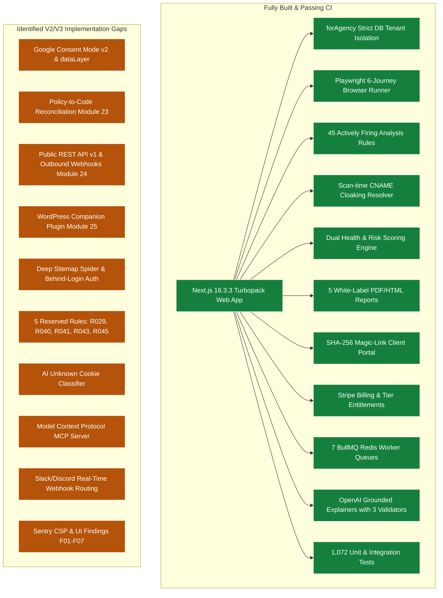
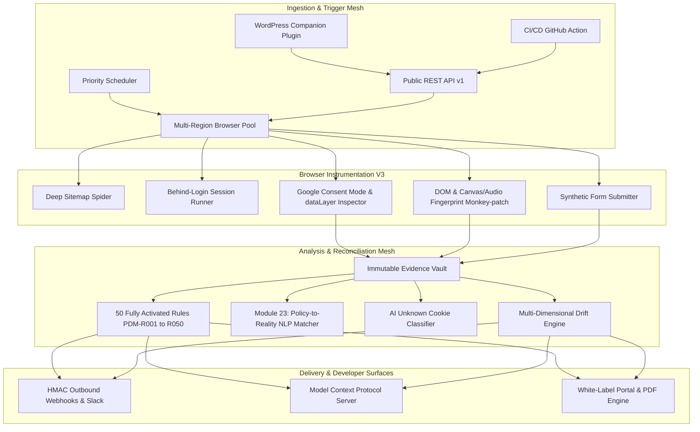
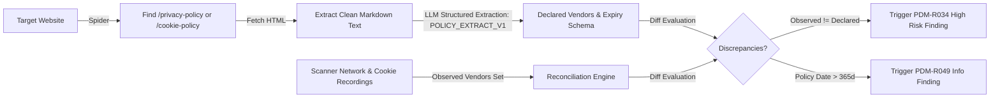

# Privacy Drift Monitor V3 — Master Architectural Specification & Implementation Roadmap

> **The Definitive Agency Privacy Governance, Continuous Audit & Drift Intelligence Platform**
> 
> Extends the V1 baseline and V2 jurisdiction matrix into an end-to-end **Autonomous Compliance Watchdog**: auditing Consent Management Platforms (CMPs), inspecting Google Consent Mode v2 & `dataLayer`, executing Policy-to-Reality reconciliations, providing Public REST APIs & Outbound Webhooks, integrating CI/CD & WordPress, activating dormant/reserved rules, and offering a native Model Context Protocol (MCP) server.
>
> Version 3.0 · Authored: 2026-09-04 · Status: Production Blueprint

---

## Executive Summary & Strategic Positioning

### The Market Vacuum: CMPs vs. Independent Auditing
Existing tools in the compliance ecosystem fall primarily into the **Consent Management Platform (CMP)** category (e.g., CookieYes, OneTrust, Cookiebot, Usercentrics). Their business model is:
$$\text{Website} \longrightarrow \text{Show Banner} \longrightarrow \text{Obtain Consent} \longrightarrow \text{Block Trackers}$$

However, web development agencies face a severe operational liability: **CMPs fail silently**.
1. A developer adds a Hotjar snippet or TikTok pixel inside Google Tag Manager (GTM) without mapping it to consent triggers.
2. A WordPress plugin update injects tracking scripts directly into the DOM, bypassing the CMP banner entirely.
3. The CMP banner claims "Reject All" was clicked, but third-party requests continue firing behind the scenes or send `granted` states in Google Consent Mode.
4. A company's published Privacy Policy claims "We never sell or share data for advertising," yet Meta and Google remarketing pixels are active in production (triggering FTC Section 5 fines).

**Privacy Drift Monitor V3** does not compete as another cookie banner vendor. Instead, it serves as the **independent, continuous watchdog of all CMPs, tags, and tracking scripts across entire agency client portfolios**.

```
┌─────────────────────────────────────────────────────────────────────────────────────────────┐
│                                   THE AGENCY WATCHDOG MOAT                                  │
├────────────────────────────────────────┬────────────────────────────────────────────────────┤
│ Traditional CMPs (CookieYes/OneTrust)  │ Privacy Drift Monitor V3                           │
├────────────────────────────────────────┼────────────────────────────────────────────────────┤
│ • Injects banner & attempts blocking   │ • External, impartial browser-level auditor        │
│ • Single-pass crawl or static scan     │ • 6-journey deep Playwright execution with diffing │
│ • No temporal drift awareness          │ • Temporal "Privacy Drift" alerts (Day N vs N-1)   │
│ • Silently bypassable by rogue tags    │ • Catches unconsented GTM tags & broken CMP logic  │
│ • High end-user traffic dependency     │ • Multi-tenant agency portal, alerts & white-label │
└────────────────────────────────────────┴────────────────────────────────────────────────────┘
```

---

## Complete Audit of Current Codebase Baseline

Before adding V3 capabilities, the exact state of the production codebase was audited on 2026-09-04:



---

## V3 Architecture Specification: The 10 Core Systems



---

### System 1: Google Consent Mode v2 & `dataLayer` Verification Engine

#### 1.1 Objective & Technical Pain
Google Consent Mode v2 mandates four fundamental consent parameters:
* `ad_storage`
* `analytics_storage`
* `ad_user_data`
* `ad_personalization`

Websites frequently misconfigure tags: GTM containers fire with default values set to `granted`, or CMP banners fail to push the `consent` update call when a user clicks "Reject All".

#### 1.2 Instrumentation via Playwright InitScript
The browser pool injects an early JavaScript proxy before any DOM or tag script loads:

```ts
// packages/scanner/src/instrumentation/consent-mode.ts
export const CONSENT_MODE_INSTRUMENTATION_SCRIPT = `
(() => {
  window.__pdm_consent_events = [];
  
  const recordEvent = (type, payload) => {
    window.__pdm_consent_events.push({
      type,
      payload: JSON.parse(JSON.stringify(payload)),
      timestamp: Date.now()
    });
  };

  // Intercept window.dataLayer.push
  let dl = window.dataLayer || [];
  window.dataLayer = new Proxy(dl, {
    set(target, prop, value) {
      if (prop === 'push' || !isNaN(prop)) {
        if (Array.isArray(value) || typeof value === 'object') {
          recordEvent('dataLayer_push', value);
        }
      }
      return Reflect.set(target, prop, value);
    }
  });

  // Intercept gtag('consent', ...) directly
  const originalGtag = window.gtag;
  window.gtag = function(...args) {
    if (args[0] === 'consent') {
      recordEvent('gtag_consent', { command: args[1], params: args[2] });
    }
    if (typeof originalGtag === 'function') {
      return originalGtag.apply(this, args);
    }
  };
})();
`;
```

#### 1.3 Verification Invariants & Rules
At the end of each consent phase (`NO_CONSENT`, `REJECT_ALL`, `ACCEPT_ALL`), the scanner extracts `window.__pdm_consent_events`:
1. **In `NO_CONSENT`:** Asserts that default state sets `ad_storage: 'denied'` and `analytics_storage: 'denied'`. If defaults are missing or set to `granted` prior to user interaction, trigger `PDM-R051: GCM_PRE_CONSENT_GRANTED` (**Critical**).
2. **In `REJECT_ALL`:** Asserts that a `consent`, `'update'` event occurs with all four parameters explicitly set to `'denied'`. If `ad_user_data` or `ad_personalization` remain `'granted'`, trigger `PDM-R052: GCM_REJECT_IGNORED` (**High**).

---

### System 2: Policy-to-Reality Reconciliation Engine (Module 23 Activation)

#### 2.1 Awakening Dormant Rules PDM-R034 & PDM-R049
* `PDM-R034`: Policy-to-code vendor mismatch (Undisclosed ad/tracking pixel).
* `PDM-R049`: Stale privacy policy (> 365 days un-updated).

#### 2.2 Extraction & Matching Pipeline


#### 2.3 Prompt Contract: `POLICY_EXTRACT_V1`
```ts
// packages/ai/src/prompts/policy-extract.ts
export const POLICY_EXTRACT_V1 = {
  version: 'POLICY_EXTRACT_V1',
  systemPrompt: `You are a compliance document parser. Extract declared advertising networks, analytics providers, session replay tools, and the effective policy date from the provided Privacy Policy text. Output strict JSON matching the schema. Never invent vendors not mentioned in the text.`,
  outputSchema: z.object({
    effectiveDate: z.string().nullable(),
    declaredVendors: z.array(z.string()),
    declaredCategories: z.array(z.enum(['NECESSARY', 'ANALYTICS', 'ADVERTISING', 'FUNCTIONAL'])),
    optOutMechanismsMentioned: z.array(z.string()),
  })
};
```

---

### System 3: Activation of Reserved Rules (R029, R040, R041, R043, R045)

Five rules were previously reserved because they lacked specific browser fact recordings. V3 introduces the required instrumentation:

| Rule ID | Name | Required Evidence Recording | V3 Implementation Mechanism |
|---|---|---|---|
| **PDM-R029** | Cookie Wall / Forcible Gating | Recorded DOM gating state | Inspect `body` style for `overflow: hidden`, backdrop overlays covering >90% viewport, and lack of dismiss button. |
| **PDM-R040** | Cross-Border PII Exfiltration | Destination-country IP resolution | Use `node-maxmind` / GeoLite2 database on every intercepted request's remote IP address. Flag EU-to-US transfers missing adequacy frameworks. |
| **PDM-R041** | Asymmetric Button Dark Pattern | Bounding boxes & contrast ratios | Capture `getBoundingClientRect()` and computed `backgroundColor` / `color` for Accept vs. Reject buttons. Flag ratio differences > 2.0. |
| **PDM-R043** | Form Submission Tracker Trigger | Synthetic form interaction | In `INTERACTIVE_ACTION` phase, inject dummy test values into forms, trigger submit, and monitor new tracker bursts within 3000ms. |
| **PDM-R045** | Canvas / WebGL / Audio Fingerprinting | JS API monkey-patching | Early inject traps on `HTMLCanvasElement.prototype.toDataURL`, `AudioContext.prototype.createOscillator`, and `WebGLRenderingContext.prototype.readPixels`. |

#### Fingerprint Instrumentation Snippet (PDM-R045):
```ts
// packages/scanner/src/instrumentation/fingerprint-trap.ts
export const FINGERPRINT_TRAP_SCRIPT = `
(() => {
  window.__pdm_fingerprint_calls = [];
  const trap = (api, fn) => {
    window.__pdm_fingerprint_calls.push({ api, timestamp: Date.now() });
    return fn;
  };

  if (window.HTMLCanvasElement) {
    const origToDataURL = HTMLCanvasElement.prototype.toDataURL;
    HTMLCanvasElement.prototype.toDataURL = function(...args) {
      trap('canvas.toDataURL');
      return origToDataURL.apply(this, args);
    };
  }

  if (window.AudioContext || window.webkitAudioContext) {
    const AudioCtx = window.AudioContext || window.webkitAudioContext;
    const origOsc = AudioCtx.prototype.createOscillator;
    AudioCtx.prototype.createOscillator = function(...args) {
      trap('audio.createOscillator');
      return origOsc.apply(this, args);
    };
  }
})();
`;
```

---

### System 4: Deep Sitemap Spider & Behind-Login Authenticated Scanning

#### 4.1 Automated Sitemap Discovery
Instead of scanning only root URL `/`, the scanner discovers `sitemap.xml` (or `robots.txt` $\rightarrow$ Sitemap directive):
1. Downloads and parses XML sitemap index.
2. Clusters URLs into archetypes: Home, Product/Service, Blog/Article, Cart/Checkout, Contact/Form, Account/Login.
3. Automatically selects up to **N representative pages** based on agency plan limits (e.g., Starter: 1 page, Growth: 5 pages, Pro: 20 pages).

#### 4.2 Form-Based Authenticated Scanning (`Scan Behind Login`)
Expands existing `basicAuthSecretRef` to full form authentication:
* Agency specifies `loginUrl`, `usernameSelector`, `passwordSelector`, `submitSelector`, and credential secrets stored in encrypted vault (`aes-256-gcm`).
* Worker executes login sequence in dedicated context, records session storage & cookies, and scans internal member dashboards or checkout funnels for rogue trackers.

---

### System 5: AI Unknown Cookie & Tracker Purpose Classifier

#### 5.1 Objective
When the deterministic database (EasyList, EasyPrivacy, DuckDuckGo Tracker Radar) encounters an unidentified cookie or script:
1. Gathers context: Cookie Name, Domain, Lifespan, Initiating Script URL, Calling DOM Stack Trace, Network Payload snippet.
2. Dispatches asynchronous background job to `@pdm/ai` using `COOKIE_CLASSIFY_V1`.
3. Stores predicted category (`ANALYTICS`, `ADVERTISING`, `FUNCTIONAL`, `NECESSARY`), vendor identity, and confidence score.
4. Auto-populates audit reports so agencies don't face unclassified "Unknown" line items.

---

### System 6: Public REST API v1 & Outbound Webhook Delivery Engine (Module 24)

#### 6.1 Public REST API v1 Specification
* **Base URL:** `/api/v1`
* **Authentication:** `Authorization: Bearer pdm_live_...` (Checked against SHA-256 hashed keys in `api_keys` table).
* **Rate Limits:** Enforced via Redis sliding-window counter (`100 req/min` standard, `500 req/min` agency scale).

| Endpoint | Method | Description |
|---|---|---|
| `/api/v1/websites` | `GET` | List all monitored websites, status, and health scores. |
| `/api/v1/websites` | `POST` | Register a new client website for continuous monitoring. |
| `/api/v1/websites/{id}/scans` | `POST` | Trigger an immediate on-demand scan. |
| `/api/v1/scans/{id}` | `GET` | Retrieve scan status, health score, and detected issues. |
| `/api/v1/scans/{id}/evidence` | `GET` | Export raw network requests, cookies, and storage dumps. |
| `/api/v1/reports/{id}/download` | `GET` | Download generated PDF white-label reports. |
| `/api/v1/webhooks` | `POST` | Register a new outbound webhook endpoint. |

#### 6.2 Outbound Webhooks Pipeline
* **Events Supported:**
  * `scan.completed`
  * `privacy_drift.detected`
  * `issue.opened`
  * `issue.resolved`
  * `gcm.misconfigured`
* **Security & Delivery:**
  * Headers: `X-PDM-Signature: t=1725440000,v1=hex_hmac_sha256(payload, secret)`
  * Queued in BullMQ `webhook` queue with exponential backoff (5 retries: 10s, 1m, 5m, 30m, 2h).
  * Dead-letter queue (DLQ) logging after repeated 5xx/timeouts.

---

### System 7: Real-Time Slack & Discord Integration

* Converts dormant Slack feature flag into active delivery:
* **Slack App / Incoming Webhook:** Rich interactive blocks displaying:
  * Client Website & Current Health Score (e.g., `88 -> 64` 🔻).
  * Identified Drift: *"New Meta Pixel detected firing in NO_CONSENT journey"*.
  * Direct deep links: `[View Full Evidence]` and `[Download Client PDF]`.
* Configurable alert thresholds: `CRITICAL_ONLY`, `ALL_DRIFT`, or `WEEKLY_DIGEST`.

---

### System 8: CI/CD Pre-Deployment Guard (GitHub Action & Vercel Webhook)

Agencies often deploy client site updates that inadvertently break CMP configurations.
* **GitHub Action (`privacy-drift-action`):**
  1. Hooks into staging preview deployment (e.g., `preview.client.com`).
  2. Calls `/api/v1/websites/{id}/scans` with blocking wait mode (`--wait-for-completion`).
  3. Checks resulting health score against agency threshold (e.g., `min_score: 85`).
  4. Fails PR build if pre-consent trackers or GCM violations are introduced, outputting a formatted PR comment with full evidence.

---

### System 9: WordPress Agency Companion Plugin (Module 25)

* **Architecture:** Ultra-lightweight PHP client (`plugins/wordpress/`) communicating with PDM Public REST API.
* **Zero Overhead:** No headless crawling or scanning inside WordPress PHP.
* **Core Functions:**
  1. Site ownership verification via meta-tag or token file.
  2. `wp-admin` Dashboard Widget displaying current Privacy Score and open issue badge.
  3. Auto-Scan Hook: Listens to `upgrader_process_complete` — triggers verification scan whenever WooCommerce, GTM, or theme files are updated.

---

### System 10: Model Context Protocol (MCP) Server for Developer Workflows

Modern developers work inside AI IDEs (Cursor, Claude Desktop, Antigravity).
* **Protocol:** JSON-RPC over stdio / Server-Sent Events (SSE).
* **Exposed MCP Tools:**
  * `pdm_list_websites`: List monitored agency websites and health scores.
  * `pdm_get_drift_timeline`: View privacy drift events for a client over the last 30 days.
  * `pdm_inspect_issue_evidence`: Fetch exact network requests, cookies, and screenshots for an issue.
  * `pdm_generate_gtm_fix`: Return ready-to-paste Google Tag Manager trigger recipes.

---

## Complete Database Schema Extensions (Prisma 6)

```prisma
// packages/database/prisma/schema.prisma (Additions for V3)

// ───────────────────────────── API Keys & Outbound Webhooks ─────────────────────────────

model ApiKey {
  id          String    @id @default(uuid())
  agencyId    String
  name        String
  keyPrefix   String    // e.g. "pdm_live_abc123"
  keyHash     String    @unique // SHA-256 hash of the raw token
  scopes      String[]  @default(["read", "write"])
  lastUsedAt  DateTime?
  expiresAt   DateTime?
  createdAt   DateTime  @default(now())

  agency      Agency    @relation(fields: [agencyId], references: [id], onDelete: Cascade)
  @@index([agencyId])
  @@map("api_keys")
}

model WebhookEndpoint {
  id          String            @id @default(uuid())
  agencyId    String
  url         String
  description String?
  secret      String            // whsec_... HMAC key
  events      String[]          // e.g. ["privacy_drift.detected", "scan.completed"]
  isActive    Boolean           @default(true)
  createdAt   DateTime          @default(now())
  updatedAt   DateTime          @updatedAt

  agency      Agency            @relation(fields: [agencyId], references: [id], onDelete: Cascade)
  deliveries  WebhookDelivery[]
  @@index([agencyId])
  @@map("webhook_endpoints")
}

model WebhookDelivery {
  id          String          @id @default(uuid())
  endpointId  String
  event       String
  payload     Json
  statusCode  Int?
  durationMs  Int?
  error       String?
  attempt     Int             @default(1)
  status      DeliveryStatus  @default(PENDING)
  createdAt   DateTime        @default(now())

  endpoint    WebhookEndpoint @relation(fields: [endpointId], references: [id], onDelete: Cascade)
  @@index([endpointId, createdAt(sort: Desc)])
  @@map("webhook_deliveries")
}

enum DeliveryStatus {
  PENDING
  SUCCESS
  FAILED
}

// ───────────────────────────── Google Consent Mode & Deep Crawling ─────────────────────────────

model ConsentModeAudit {
  id                    String   @id @default(uuid())
  scanId                String   @unique
  isConsentModeDetected Boolean  @default(false)
  preConsentAdStorage   String?  // 'denied' | 'granted'
  preConsentAnalytics   String?  // 'denied' | 'granted'
  postRejectAdStorage   String?
  postRejectAnalytics   String?
  violationsDetected    String[] // e.g. ["PDM-R051", "PDM-R052"]
  rawEvents             Json?
  createdAt             DateTime @default(now())

  scan                  Scan     @relation(fields: [scanId], references: [id], onDelete: Cascade)
  @@map("consent_mode_audits")
}

model SitemapCrawlConfig {
  id              String   @id @default(uuid())
  websiteId       String   @unique
  maxPages        Int      @default(5)
  discoveredUrls  String[]
  selectedUrls    String[]
  lastCrawledAt   DateTime?
  updatedAt       DateTime @updatedAt

  website         Website  @relation(fields: [websiteId], references: [id], onDelete: Cascade)
  @@map("sitemap_crawl_configs")
}

model AuthenticatedScanConfig {
  id                String   @id @default(uuid())
  websiteId         String   @unique
  loginUrl          String
  usernameSelector  String
  passwordSelector  String
  submitSelector    String
  encryptedSecrets  String   // AES-256-GCM serialized payload
  isActive          Boolean  @default(false)
  updatedAt         DateTime @updatedAt

  website           Website  @relation(fields: [websiteId], references: [id], onDelete: Cascade)
  @@map("authenticated_scan_configs")
}
```

---

## The 50+ Rule Inventory: Fully Mapped & Active

V3 eliminates all dormant and reserved states, bringing the rule engine to **52 actively evaluated rules**:

```
PDM-R001 to PDM-R025: Baseline Core Consent & Tracker Rules (V1)
PDM-R026 to PDM-R030: EU Strict & UK PECR Jurisdiction Rules (V2)
PDM-R031 to PDM-R033: US CCPA & GPC Opt-Out Rules (V2)
PDM-R034: Policy-to-Code Undisclosed Vendor (Activated in V3 via Module 23)
PDM-R035 to PDM-R037: FTC Sensitive Field & CIPA Session Replay Rules (V2)
PDM-R038 to PDM-R039: CNAME Cloaking & Storage Supercookie Rules (V2)
PDM-R029: Cookie Wall / Forcible Gating (Activated in V3 via DOM Gating Traps)
PDM-R040: Cross-Border PII Exfiltration (Activated in V3 via IP Geo-Resolution)
PDM-R041: Asymmetric Button Dark Pattern (Activated in V3 via Bounding Box Contrast)
PDM-R042 to PDM-R044: Interaction Delay & GTM Container Re-Injection Rules (V2)
PDM-R043: Form Submission Conversion Pixel (Activated in V3 via Synthetic Form Submit)
PDM-R045: Canvas / Audio Fingerprinting (Activated in V3 via JS API Traps)
PDM-R046 to PDM-R048: Script Payload Weight, Insecure HTTP, SameSite Rules (V2)
PDM-R049: Stale Privacy Policy Date (Activated in V3 via Policy Parser)
PDM-R050: Bot Challenge Geo-Egress Failure (V2)
PDM-R051: Google Consent Mode Pre-Consent Granted (NEW in V3)
PDM-R052: Google Consent Mode Reject Ignored (NEW in V3)
```

---

## UI/UX Defect Remediation & Interface Polish (F01–F07)

Based on the empirical audit in `UI_Func.md`, V3 resolves every outstanding interface defect:

1. **Fix F01 — Sentry CSP Blocked:**
   * Modify [src/proxy.ts](file:///d:/ABUHASAN/WEB/Privacy-Drift-Monitor/src/proxy.ts): Add `https://*.ingest.de.sentry.io https://*.sentry.io` to `connect-src` so client-side errors report correctly.
2. **Fix F02 — AI "Recommended Fix" Card Copy:**
   * In [issue-ai-sections.tsx](file:///d:/ABUHASAN/WEB/Privacy-Drift-Monitor/src/components/ai/issue-ai-sections.tsx): Split generic `t("ai.notGeneratedYet")` into feature-specific empty states for explanations vs. technical remediation fixes.
3. **Fix F03 — Inline Evidence on Issue Detail Page:**
   * Render real, recorded evidence inline (request URL, initiator stack, consent phase, timestamp, and cookie attributes) directly on `/app/issues/[id]` rather than forcing the user to navigate back to the scan view.
4. **Fix F04 — Portal Login Container & Button State:**
   * In [login-form.tsx](file:///d:/ABUHASAN/WEB/Privacy-Drift-Monitor/src/components/portal/login-form.tsx): Wrap login in a clean card container, eliminate premature button disabled state, and provide clear submission feedback.
5. **Fix F05 — Website Detail Address Redundancy:**
   * Suppress "Address as entered" on Website Overview if it is identical to canonical normalized URL.
6. **Fix F06 — Website Overview Tab Enrichment:**
   * Embed Health Score trend sparkline, recent scan history table, and top active issues summary directly on the Overview tab.

---

## Implementation Roadmap & Phase Sequence (Phases 13 to 18)

```
├── Phase 13: Google Consent Mode v2 & Script Instrumentation Engine (Weeks 1-2)
│   ├── Browser init-script for dataLayer & gtag consent traps
│   ├── ConsentModeAudit Prisma model & scanner extraction
│   └── PDM-R051 & PDM-R052 rule implementations & verification tests
│
├── Phase 14: Policy-to-Code NLP Engine (Module 23 Activation) (Weeks 3-4)
│   ├── Sitemap policy link discovery & clean text extraction
│   ├── POLICY_EXTRACT_V1 prompt & Zod schema validation
│   └── Activate PDM-R034 and PDM-R049 with full test coverage
│
├── Phase 15: Reserved Rules Activation & Deep Instrumentation (Weeks 5-6)
│   ├── DOM gating inspector for PDM-R029 (Cookie Walls)
│   ├── GeoIP destination resolution for PDM-R040 (Cross-border transfers)
│   ├── Bounding box contrast analyzer for PDM-R041 (Dark Patterns)
│   ├── Synthetic form submitter for PDM-R043
│   └── Canvas/WebGL/Audio traps for PDM-R045 (Fingerprinting)
│
├── Phase 16: Public REST API v1 & Outbound Webhooks Mesh (Module 24) (Weeks 7-8)
│   ├── ApiKey authentication & rate-limiting middleware
│   ├── REST route handlers under /api/v1/*
│   ├── HMAC-SHA256 outbound webhook delivery queue & retry worker
│   └── Slack interactive notification blocks integration
│
├── Phase 17: Deep Spider, Authenticated Scanning & AI Classifier (Weeks 9-10)
│   ├── Sitemap parser & multi-page archetypal scan selection
│   ├── AES-256-GCM form login runner for authenticated dashboards
│   └── COOKIE_CLASSIFY_V1 prompt for automated unknown cookie categorization
│
└── Phase 18: Developer Tooling, MCP Server & Companion Plugin (Weeks 11-12)
    ├── JSON-RPC Model Context Protocol (MCP) server for Claude/Cursor
    ├── GitHub Action (privacy-drift-action) for CI/CD staging gates
    ├── WordPress companion plugin (plugins/wordpress/)
    └── Resolution of UI/UX audit items F01 to F07
```

---

## Verification & Quality Contracts V3

1. **Deterministic Authority Non-Negotiable:** Fact extraction (network requests, cookies, consent states, CNAMEs, DOM elements) remains 100% deterministic via Playwright instrumentation. AI models explain and categorize; they never create facts.
2. **Zero Breaking Database Migrations:** All schema additions are purely additive (nullable or default-backed fields). Existing tenants, scans, and evidence remain unaffected.
3. **CI Terminology Enforcement:** No legal claims or forbidden terms (`GDPR breach`, `violation`, `compliant`, `legal advice`) may enter UI strings, email copy, API responses, or AI prompts.
4. **Coverage & Performance Budgets:**
   * Core packages (`@pdm/scanner`, `@pdm/analysis`, `@pdm/billing`) maintain > 90% statement test coverage.
   * New scan instrumentation overhead must not increase per-page scan duration by more than 15%.

---
*Privacy Drift Monitor V3 · The Global Architecture Blueprint · Ready for Execution*
