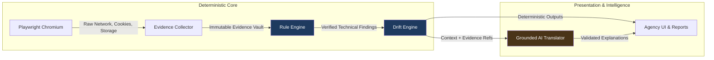
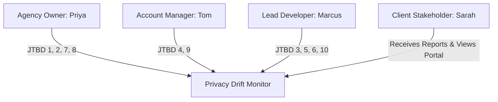
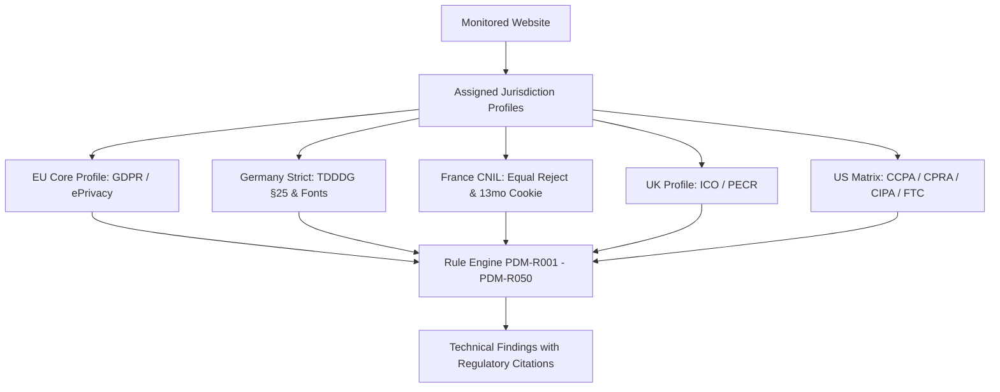
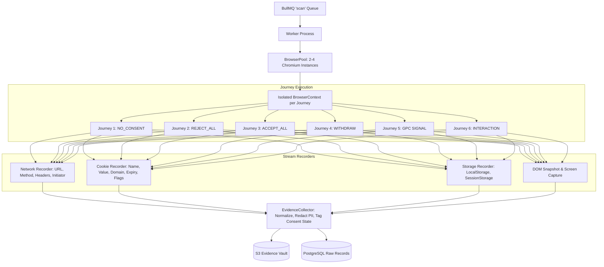
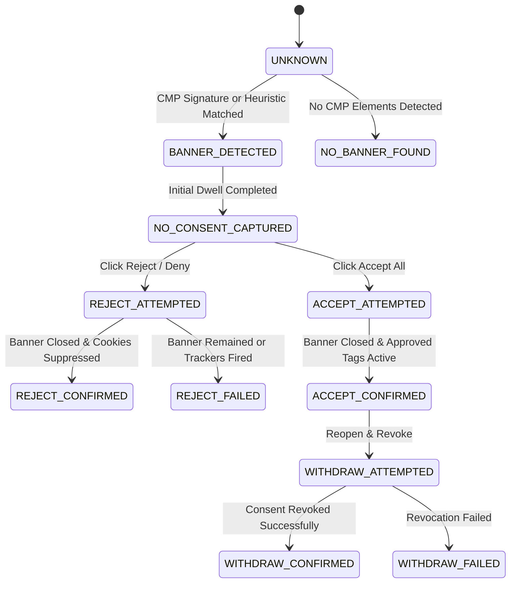
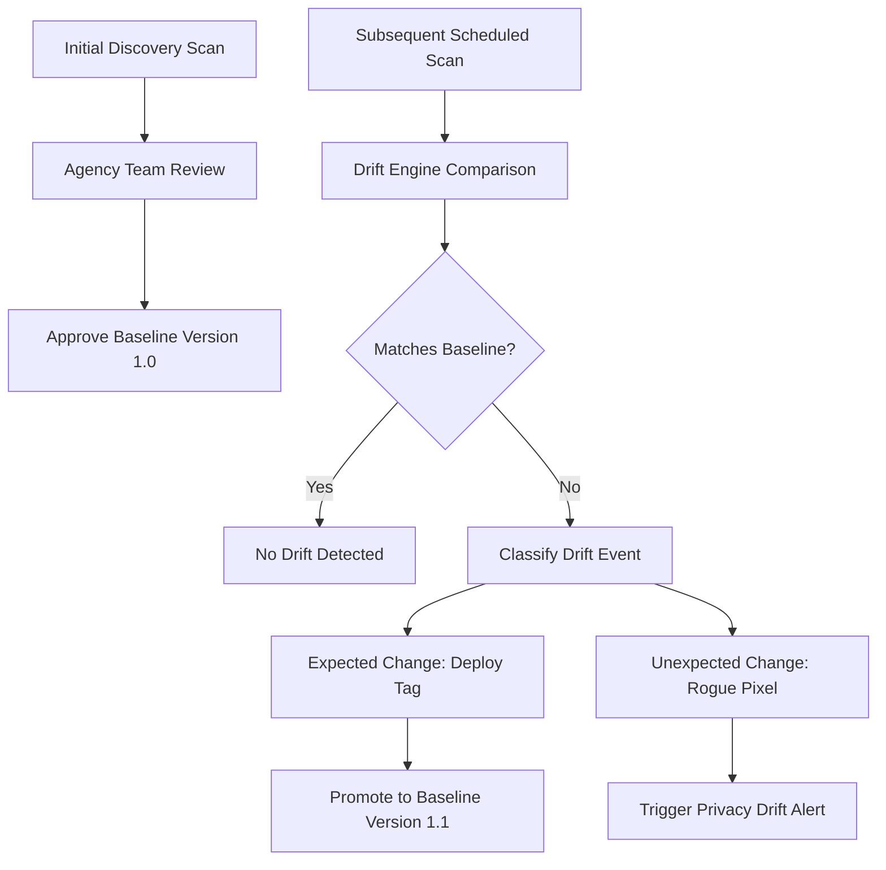

# Privacy Drift Monitor — Master Production Specification & Architecture Plan

> **Continuous Privacy, Consent & Tracking Governance Platform for Web Agencies & Global Digital Portfolios**
>
> Version 2.1 (Production Master) · Baseline: Next.js 16.3.3 (Turbopack) · React 19.2 · TypeScript 5.x · PostgreSQL 16 (Prisma 6) · Redis 7 (BullMQ 5) · Playwright / Chromium · Clerk Core 3 · Stripe · Resend · S3-Compatible Object Storage · OpenAI Provider Abstraction · Sentry · Tailwind CSS v4

---

## Document Navigation Map

| Part | Title | Core Coverage |
|---|---|---|
| [Part 0](#part-0--architectural-foundations--framework-baseline) | Architectural Foundations & Framework Baseline | Governing rules, non-negotiable principles, verified Next.js 16.3.3 & Clerk Core 3 baselines |
| [Part I](#part-i--product-strategy-icp-personas--jtbd) | Product Strategy, ICP, Personas & JTBD | Agency ICP, buyer vs. user personas, 10 JTBDs, value propositions, non-goals, terminology |
| [Part II](#part-ii--competitive-intelligence--differentiation-moat) | Competitive Intelligence & Differentiation Moat | CMP vs. one-off scanner vs. enterprise GRC comparison, competitive wedge, defensibility |
| [Part III](#part-iii--regulatory-matrix-jurisdiction-profiles--rules) | Regulatory Matrix, Jurisdiction Profiles & Rule Engine | Pluggable jurisdiction engine (EU 27, UK, US CCPA/CPRA/CIPA/FTC, CH, CA), 50 rules (`PDM-R001`–`PDM-R050`) |
| [Part IV](#part-iv--product-scope-tiering--traceability-matrix) | Product Scope, Tiering & Feature Traceability | Release tiers (MVP, V1, V1.5, V2, V3, Enterprise), end-to-end traceability from pain to monitoring |
| [Part V](#part-v--information-architecture--complete-page-specifications) | Information Architecture & Complete Page Specs | Route tree (87+ routes), page specs for Marketing, Agency App, Admin (15 views), Client Portal |
| [Part VI](#part-vi--the-scanner-crawler-engine--browser-infrastructure) | The Scanner, Crawler Engine & Browser Infrastructure | Playwright pooling, 6 consent journeys, geo-proxy mesh, CNAME de-anonymization, SSRF guard |
| [Part VII](#part-vii--consent-engine-cmp-adapters--state-machine) | Consent Engine, CMP Adapters & State Machine | CMP adapter interface, 8 supported CMPs + heuristic fallback, formal consent state machine |
| [Part VIII](#part-viii--tracker-cookie--network-intelligence) | Tracker, Cookie & Network Intelligence | Vendor catalog, category mapping, unknown tracker lifecycle (AI triage → human review → published rule) |
| [Part IX](#part-ix--privacy-drift-engine--baseline-management) | Privacy Drift Engine & Baseline Management | Longitudinal diffing, approved baseline workflow, change classification, maintenance windows |
| [Part X](#part-x--health-score-risk-engine--scan-confidence) | Health Score, Risk Engine & Scan Confidence | Explainable 0–100 Privacy Monitoring Score vs. distinct Scan Confidence Index (0–100%) |
| [Part XI](#part-xi--evidence-architecture-tamper-evident-vault--redaction) | Evidence Architecture, Vault & Redaction | Normalized evidence records, SHA-256 integrity hashing, PII & authorization header sanitization |
| [Part XII](#part-xii--issue-management-automated-remediation--verification) | Issue Management, Automated Remediation & Verification | Issue lifecycle, GTM auto-fix recipes, CMP snippet generator, evidence-based re-scan verification |
| [Part XIII](#part-xiii--agency-white-labeling-reports--client-portal) | Agency White-Labeling, Reports & Client Portal | 5 report types, branding tokens, PDF/HTML compilation, passwordless magic-link client portal |
| [Part XIV](#part-xiv--grounded-ai-architecture-safety--cost-control) | Grounded AI Architecture, Safety & Cost Control | Evidence grounding validation, prompt versions (`*_V<n>`), 3-tier model routing, token budget breaker |
| [Part XV](#part-xv--service-integrations--companion-ecosystem) | Service Integrations & Companion Ecosystem | Slack, Linear, Jira, WordPress companion plugin, Cloudflare Turnstile, Sentry, OpenTelemetry |
| [Part XVI](#part-xvi--public-api--outbound-webhooks-specification) | Public API & Outbound Webhooks Specification | Agency REST API, API key hashing (`pdm_live_...`), HMAC-SHA256 signed outbound webhooks |
| [Part XVII](#part-xvii--data-architecture--unified-prisma-schema) | Data Architecture & Unified Prisma Schema | PostgreSQL relational model (46+ models), tenant isolation (`forAgency`), indexes, retention |
| [Part XVIII](#part-xviii--asynchronous-pipeline-queues--scheduler) | Asynchronous Pipeline, Queues & Scheduler | 8 BullMQ queues, colon sanitization contract, cron scheduler with jitter, graceful shutdown |
| [Part XIX](#part-xix--security-threat-model-isolation--rbac) | Security Threat Model, Isolation & RBAC | Defense-in-depth, container sandboxing, SSRF defense, CSP dual-policy, RBAC permissions matrix |
| [Part XX](#part-xx--commercial-architecture-billing--unit-economics) | Commercial Architecture, Billing & Unit Economics | Stripe multi-currency catalogue, 9-point entitlement enforcement, grace periods, cost model |
| [Part XXI](#part-xxi--platform-operations-sre-observability--dr) | Platform Operations, SRE, Observability & DR | Health probes, structured pino logging, Sentry tracing, PITR backups, RPO/RTO disaster recovery |
| [Part XXII](#part-xxii--design-system-tokens--wcag-22-aa-accessibility) | Design System, Tokens & WCAG 2.2 AA Accessibility | Tailwind v4 semantic tokens, high-contrast palette (≥ 4.5:1), keyboard traps, non-color indicators |
| [Part XXIII](#part-xxiii--quality-assurance-fixture-matrix--chaos-testing) | Quality Assurance, Fixture Matrix & Chaos Testing | F01–F30 fixture matrix, unit/integration/E2E testing, browser crash & dependency outage chaos tests |
| [Part XXIV](#part-xxiv--production-readiness-scorecard--launch-checklist) | Production Readiness Scorecard & Launch Checklist | Readiness scorecard across 14 areas, launch blockers, phased beta rollout program |
| [Part XXV](#part-xxv--feature-preservation-matrix--plan-changelog) | Feature Preservation Matrix & Plan Changelog | Full preservation matrix, changelog documenting retained, improved, and added capabilities |

---

# Part 0 — Architectural Foundations & Framework Baseline

## 0.1 The Core Operating Principle

```
The deterministic scanner captures immutable facts.
The rule engine evaluates technical assertions against jurisdiction benchmarks.
The Privacy Drift engine detects variance against approved baselines.
The grounded AI layer explains findings and formats recommendations without inventing facts.
The digital agency decides what remediation action to execute for their client.
```

The system is a **technical privacy monitoring and observability platform**. It is not a law firm, does not provide legal advice, does not certify compliance, and never acts as an ungrounded "AI GDPR judge." Findings must be readable and verifiable with or without an LLM.



## 0.2 Non-Negotiable Architectural Principles

1. **P1 — The deterministic scanner is the sole source of truth.** No LLM may decide whether a script fired, a cookie was written, or consent was granted.
2. **P2 — AI explains evidence; AI never invents facts.** Every AI output must validate against verified `IssueEvidence` primary keys via `evidence_refs`. Any ungrounded reference fails at the schema boundary.
3. **P3 — Multi-tenant isolation at the data layer.** Cross-tenant leakage is prevented by Prisma client extensions (`forAgency(agencyId)`). Agency A cannot query, mutate, or access Agency B's websites, scans, reports, or evidence.
4. **P4 — Zero silent failure.** An interrupted or blocked scan produces a first-class `PARTIAL` or `INCONCLUSIVE` outcome, never a clean health score.
5. **P5 — Immutable audit evidence.** Evidence records are write-only. Corrections supersede earlier findings; they never mutate historical scan records.
6. **P6 — Replayable pipeline.** Analysis downstream of the `EvidenceCollector` is pure. Re-running analysis against raw evidence reproduces identical findings.

## 0.3 Framework & Stack Reality (Next.js 16.3.3 & React 19)

| Layer | Standard | Production Rule |
|---|---|---|
| **Framework** | Next.js 16.3.3 (Turbopack) | Root `src/app/` layout. `apps/` directory is abolished. `src/proxy.ts` replaces deprecated `middleware.ts`. |
| **Server Actions** | Next 16 Server Actions | Re-authorize inside every Server Action. Proxy does not cover action POST invocations. |
| **Request Context** | React 19 Promises | `cookies()`, `headers()`, `params`, `searchParams` are Promises (`const { id } = await params`). |
| **Auth** | Clerk Core 3 (`@clerk/nextjs@^7`) | `<Show when="signed-in">` replaces deleted `<SignedIn>`. Static marketing pages use client auth islands. |
| **Styling** | Tailwind CSS v4 | `@theme inline` inside `src/app/globals.css`. No `tailwind.config.js`. WCAG AA contrast ≥ 4.5:1. |
| **Job Queue** | BullMQ 5 + Redis 7 | No colons `:` in job IDs (`toJobId()` rewrite mandatory). Separate scan and worker report browser contexts. |
| **Database** | PostgreSQL 16 + Prisma 6 | Tracked migrations only. Raw `prisma` client banned in app code (`forAgency` required). |

---

# Part I — Product Strategy, ICP, Personas & JTBD

## 1.1 Vision & Mission

Digital agencies build and maintain websites for clients, often charging ongoing monthly retainers for hosting, maintenance, and care plans. However, privacy and consent compliance on modern web stacks is dynamic: tag managers, marketing plugins, and tracking pixels change without engineering review.

**Privacy Drift Monitor continuously audits client websites in real browsers, detects unauthorized tracking or consent regressions, provides verifiable technical evidence, and empowers agencies to monetize privacy governance as a recurring service line.**

## 1.2 Ideal Customer Profile (ICP)

* **Primary Segment:** Web development, WordPress, Shopify, and full-service digital marketing agencies.
* **Firmographics:** 3–50 employees, managing 15–250 client websites.
* **Commercial Posture:** Sells monthly care plans or retainers ($100–$1,000/month per site).
* **Buying Trigger:** Client inquiries regarding GDPR, CPRA, or third-party pixel liabilities, or an agency-wide initiative to de-risk client portfolios and create new high-margin revenue streams.
* **Anti-ICP:** Individual site owners needing one-off audits, enterprise legal departments seeking complex RoPA/DPIA enterprise GRC suites, and engineers looking for code-only linters.

## 1.3 Personas & Jobs To Be Done



| ID | Persona | Job To Be Done (JTBD) | Product Solution |
|---|---|---|---|
| **J1** | Agency Owner | "Show me which of my 80 client websites have privacy or tracking regressions today." | Portfolio Dashboard & Attention Center |
| **J2** | Agency Owner | "Turn ongoing privacy verification into an automated $75/month care plan add-on." | White-Label Scheduled Reports & Client Portal |
| **J3** | Developer | "Show me the exact request payload, cookie, initiator, and screenshot that proved this issue." | Evidence Vault & Request Initiator Chain |
| **J4** | Account Manager | "Explain this technical tracking issue to my client in plain English without alarmism." | Grounded AI Client Message Generator |
| **J5** | Developer | "Give me copy-paste Google Tag Manager and CMP configuration snippets to resolve the issue." | Automated Remediation Engine |
| **J6** | Developer | "Prove that my code fix actually stopped the rogue pixel after deployment." | Evidence-Based Verification Re-Scan |
| **J7** | Client Lead | "Provide an executive-ready monthly summary I can show my leadership." | Automated Monthly White-Label PDF |
| **J8** | Agency Owner | "Protect my agency from liability if a client installs an unapproved pixel." | Historical Privacy Drift Audit Trail |
| **J9** | Account Manager | "Do not spam my inbox with 20 alerts when an agency team deploys updates." | Alert Aggregation & Maintenance Windows |
| **J10** | Developer | "Do not cry wolf with false positives when a tag is legitimately essential." | False-Positive Suppression & Confidence Index |

## 1.4 Approved Terminology Matrix (CI Enforced)

The platform observes and reports **technical facts**. It never delivers legal advice or declares legal compliance.

| Approved Terminology | Strictly Prohibited Terminology | Rationale |
|---|---|---|
| Potential issue / Finding | Violation / Infringement | System evaluates technical assertions, not judicial rulings |
| Tracker detected before consent | GDPR breach / Illegal tracking | Technical fact vs. legal characterization |
| Review recommended | You are required to / You must | Monitoring guidance vs. legal counsel |
| Technical evidence | Proof of non-compliance | Verifiable network artifact vs. legal conclusion |
| Detected / Not detected / Inconclusive | Compliant / Non-compliant / Legal | Binary technical states vs. external legal certification |
| Privacy Monitoring Score | Compliance Percentage | Risk index based on technical rules, not statutory immunity |

---

# Part II — Competitive Intelligence & Differentiation Moat

| Dimension | One-Off Scanners (Cookiebot, BuiltWith) | Enterprise GRC (OneTrust, TrustArc) | Privacy Drift Monitor |
|---|---|---|---|
| **Core Method** | Single-page static HTTP crawl | Manual self-attestation questionnaires | **Deterministic multi-journey Playwright browser execution** |
| **Consent Attribution** | Checks if banner HTML is present | Assumes compliance from policy text | **Tags every network request & cookie with the active consent state** |
| **Reject & Withdraw Testing** | Ignored | Ignored | **Automated testing of Reject All and Withdrawal journeys** |
| **Privacy Drift** | Snapshots only; no historical diff | Annual workflow audits | **Continuous longitudinal diffing against approved baselines** |
| **Agency Monetization** | Direct-to-consumer only | Multi-thousand dollar enterprise contracts | **Agency-native white-label reports, client portals & care plan pricing** |
| **Remediation** | None | Manual legal consulting tasks | **Automated GTM tag triggers and CMP code snippets** |

---

# Part III — Regulatory Matrix, Jurisdiction Profiles & Rule Engine

## 3.1 Pluggable Jurisdiction Framework

Rather than hardcoding compliance rules into the scanner, the platform implements a **pluggable regulatory profile architecture**. Each profile contains a versioned set of technical rules, statutory references, and severity weights.



## 3.2 Master Rule Catalog (`PDM-R001` to `PDM-R050`)

Every rule is deterministic, testable against headless fixtures, and produces structured technical findings.

### Category 1: Pre-Consent & Banner Hygiene (Core EU/UK/Global)
* **`PDM-R001` (Critical):** Network request initiated to known advertising/tracking vendor prior to explicit consent interaction (`NO_CONSENT`).
* **`PDM-R002` (High):** Non-essential cookie written or updated before consent interaction.
* **`PDM-R003` (High):** LocalStorage or SessionStorage tracking identifier stored before consent.
* **`PDM-R004` (Medium):** Third-party tracking script injected into DOM before consent, even if network request was delayed.
* **`PDM-R005` (High):** Tracking request fired during page unload or visibility change prior to consent.

### Category 2: Reject All & Consent Enforcement
* **`PDM-R011` (Critical):** Tracking vendor request fired after user explicitly activated "Reject All" / "Deny".
* **`PDM-R012` (High):** Non-essential cookie created or renewed after user triggered "Reject All".
* **`PDM-R013` (High):** Tracking cookies remain active and persist across page navigation following consent withdrawal.
* **`PDM-R014` (Critical):** Consent Management Platform missing a functional, accessible first-layer "Reject All" button (CNIL/AEPD benchmark).
* **`PDM-R015` (Medium):** Deceptive banner styling: "Reject" button contrast ratio fails accessibility standards or is obscured relative to "Accept".

### Category 3: Cookie Hygiene & Lifetime Standards
* **`PDM-R021` (Medium):** Cookie lifespan exceeds regulatory maximum (e.g., French CNIL 13-month limit; ePrivacy 390-day standard).
* **`PDM-R022` (High):** Sensitive cookie missing `Secure` attribute on HTTPS site.
* **`PDM-R023` (High):** Cross-site cookie missing `SameSite=None` or `SameSite` attribute omitted.
* **`PDM-R024` (Medium):** First-party cookie storing unpartitioned cross-domain tracking ID.
* **`PDM-R025` (Low):** Cookie declared in CMP privacy declaration is not observed during scan (Declaration Stale).

### Category 4: US State Laws & Global Privacy Control (CCPA / CPRA)
* **`PDM-R031` (Critical):** Website fails to honor Global Privacy Control (`Sec-GPC: 1`); third-party advertising tags fire despite browser opt-out header.
* **`PDM-R032` (High):** California visitor traffic not provided with a visible, working "Do Not Sell or Share My Personal Information" mechanism.
* **`PDM-R033` (High):** Ad tech pixel transmits hashed personal identifiers (SHA-256 emails/phones) to Meta/TikTok without opt-out validation.

### Category 5: US Wiretapping & Session Replay (CIPA / State Wiretap Acts)
* **`PDM-R036` (Critical):** Session replay or keystroke logging script (Hotjar, FullStory, Clarity) captures unmasked sensitive form fields (passwords, payment cards, SSN, healthcare inputs).
* **`PDM-R037` (High):** Keystroke recorder active on user input fields prior to explicit consent or wiretap disclosure notice.

### Category 6: FTC Act §5 Policy-to-Code Reconciliation
* **`PDM-R041` (High):** Network traffic analysis discovers advertising pixels (Meta, Google, Criteo) transmitting data that contradicts published privacy policy declarations.
* **`PDM-R042` (Medium):** Undisclosed third-party tracker vendor discovered on site that does not appear in published privacy policy list.

### Category 7: Privacy Drift & Infrastructure Cloaking
* **`PDM-R046` (High):** Privacy Drift: New unapproved tracker vendor detected that was absent in the approved baseline scan.
* **`PDM-R047` (Medium):** Privacy Drift: Cookie attribute modified (lifetime extended or security flags removed) compared to baseline.
* **`PDM-R048` (High):** First-Party CNAME Cloaking: DNS resolution reveals a sub-domain (e.g., `metrics.client.com`) resolving to third-party ad network IP space.
* **`PDM-R049` (Medium):** Third-party CDN font or stylesheet request leaking visitor IP address to external host without consent (German LG München benchmark).
* **`PDM-R050` (Critical):** Consent Regression: Website health score drops by more than 20 points within a 24-hour monitoring window.

---

# Part IV — Product Scope, Tiering & Feature Traceability

## 4.1 Release Phasing & Lifecycle Tiers

Every feature is classified into a release tier to ensure immediate execution without sacrificing architectural ambition:

* **MVP (Phase 0–4):** Core agency SaaS, Playwright 4-journey scanner, Usercentrics/Cookiebot/OneTrust adapters, 25 rules, Privacy Drift, white-label reports, Stripe billing. *(Fully Built & Verified)*
* **V1 (Phase 5–7):** Grounded AI explanations, 15-view admin panel, free public scanner, Sentry observability, WCAG AA contrast, E2E suite. *(Substantially Built & Verified)*
* **V1.5 (Fast-Follow):** Outbound webhook engine, Slack alert integration, CSV/Excel raw evidence export, maintenance windows.
* **V2 (Global & Enterprise):** Global Privacy Control (GPC), Multi-region geo-proxy mesh, Session replay CIPA analyzer, CNAME cloaking de-anonymization, Policy-to-Code auditor.
* **V3 (Scale & Automation):** Automated GTM container remediation pull requests, WordPress companion plugin, custom domain CNAME routing for client portal.
* **Enterprise:** Single Sign-On (SAML/SCIM via Clerk), dedicated egress proxy IPs, on-premise scan worker agents, custom rule authoring environment.

## 4.2 End-to-End Feature Traceability Matrix

| Feature | Business Pain | User Outcome | UI Surface | API Route | DB Models | Queue / Worker |
|---|---|---|---|---|---|---|
| **Consent Scanner** | Rogue pixels fire unannounced | Deterministic consent verification | `/app/websites/[id]/scans` | `POST /api/websites/[id]/scans` | `Scan`, `ScanPhase`, `NetworkRequest` | `scan` (BullMQ) |
| **Privacy Drift** | Clients modify site without telling agency | Instant regression notification | `/app/drift` | `GET /api/websites/[id]/drift` | `PrivacyDriftEvent`, `ScanBaseline` | `scan-analysis` |
| **Grounded AI** | AMs cannot explain technical issues | Client-ready email in 2 clicks | `/app/issues/[id]` | `POST /api/ai/generate` | `AIRequest`, `IssueEvidence` | `ai` (BullMQ) |
| **White-Label** | Retainers feel like unjustified costs | Branded proof of work | `/app/reports` | `POST /api/reports` | `Report`, `AgencyBranding` | `report` (BullMQ) |
| **GPC Detection** | US state law fines ($7,500/violation) | Automatic opt-out verification | `/app/websites/[id]/consent` | `POST /api/websites/[id]/scans` | `GpcAuditRecord`, `Issue` | `scan` (BullMQ) |
| **Free Scanner** | Agency prospecting is slow and cold | High-converting sales leads | `/free-scanner` | `POST /api/public/free-scan` | `FreeScanSession`, `FreeScanLead` | `free-scan` (isolated) |

---

# Part V — Information Architecture & Complete Page Specifications

## 5.1 Route Hierarchy

```
PUBLIC (Marketing & Legal)
├── /                                   Homepage (Hero, Value Prop, Pricing preview)
├── /features                           Feature overview hub
├── /features/consent-monitoring        Deep-dive: Multi-journey consent auditing
├── /features/privacy-drift             Deep-dive: Baseline diffing & regression alerts
├── /features/white-label-reports       Deep-dive: Agency care plan reporting & portal
├── /how-it-works                       Architecture & scanning pipeline explainer
├── /pricing                            Plan picker, currency toggle, comparison matrix
├── /free-scanner                       Public lead-gen scanner
│   └── /free-scanner/[token]           Public scan results with lead capture unlock
├── /blog & /resources                  Educational content & compliance playbooks
├── /about & /contact                   Company information and support contact
├── /bot                                Public crawler disclosure & allowlist documentation
└── /legal/[doc]                        Terms, Privacy Policy, Cookie Policy, Disclaimer

AGENCY APPLICATION (/app — Authenticated via Clerk)
├── /app                                Agency Overview Dashboard & Attention Center
├── /app/onboarding                     First-run agency setup & website import wizard
├── /app/websites                       Portfolio website index (Table, filters, status)
│   ├── /app/websites/new               Single website onboard flow
│   ├── /app/websites/import            Bulk CSV website onboard flow
│   └── /app/websites/[websiteId]       Website Hub
│       ├── /overview                   Health score, recent drift, open issues
│       ├── /issues                     Active technical findings on this site
│       ├── /scans                      Scan history & live progress inspector
│       ├── /trackers                   Discovered vendor inventory & scripts
│       ├── /cookies                    Cookie registry, attributes, lifetimes
│       ├── /consent                    CMP behavior across consent journeys
│       ├── /drift                      Timeline of baseline variance
│       ├── /evidence                   Raw network & storage audit vault
│       └── /settings                   Scan frequency, jurisdiction profiles, alerts
├── /app/issues                         Cross-portfolio issue triage queue
│   └── /app/issues/[issueId]           Issue detail, evidence chain, AI explanations, fix recipes
├── /app/drift                          Cross-portfolio Privacy Drift feed
├── /app/reports                        White-label report library & scheduler
│   ├── /app/reports/new                Custom report builder
│   └── /app/reports/[reportId]         Report preview & PDF download
├── /app/clients                        Client directory & website assignment
│   ├── /app/clients/new                New client profile creation
│   └── /app/clients/[clientId]         Client rollup dashboard & portal access
├── /app/alerts                         Alert rule builder & alert event history
├── /app/billing                        Plan tier, usage meters, invoices, payment portal
├── /app/team                           Member management, roles, pending invites
└── /app/settings                       Agency-wide configurations
    ├── /general                        Agency metadata, timezone, slug
    ├── /branding                       White-label logo, primary colors, custom footer
    ├── /scanning                       Global scan defaults, user-agent, retry rules
    ├── /ai                             AI model tier, monthly credit limits, auto-explain
    ├── /security                       Two-factor enforcement, session timeouts
    └── /integrations                   Slack, webhooks, Linear, Jira connections

CLIENT PORTAL (/portal — Authenticated via Magic Link)
├── /portal                             Client executive dashboard (Health score, summary)
├── /portal/issues                      Simplified issue list with non-alarmist descriptions
├── /portal/reports                     Downloadable white-label PDF archive
├── /portal/scans                       High-level scan history log
└── /portal/settings                    Notification contacts & display preferences

SUPER-ADMIN CONSOLE (/admin — Restricted to isSuperAdmin: true)
├── /admin                              Platform operations overview & system health
├── /admin/agencies                     Agency directory, plan overrides, suspension controls
├── /admin/users                        Global user index & authentication records
├── /admin/websites                     Global website index & scan status
├── /admin/scans                        Live scanner inspector across all tenants
├── /admin/queue                        BullMQ queue depths, latency, job retry tooling
├── /admin/issues                       Global finding distribution & rule telemetry
├── /admin/trackers                     Master vendor catalog curation & CNAME rules
├── /admin/ai-usage                     Token consumption, cost per feature, prompt telemetry
├── /admin/billing                      Stripe subscription reconciliation & revenue metrics
├── /admin/feature-flags                Global kill switches & percentage rollouts
├── /admin/logs                         Platform audit logs & security exceptions
└── /admin/system-health                Postgres, Redis, and S3 connectivity & latencies
```

---

# Part VI — The Scanner, Crawler Engine & Browser Infrastructure

## 6.1 Scanner Architecture & Isolation



## 6.2 Browser Lifecycle & Resource Pooling

To prevent memory leaks and container degradation over 24-hour operational cycles:
1. **Reuse Browsers, Never Reuse Contexts:** Chromium instances launch with strict resource flags (`--disable-dev-shm-usage`, `--disable-gpu`, `--js-flags=--max-old-space-size=512`).
2. **Context Isolation:** Every consent journey executes in a fresh, isolated `BrowserContext` with dedicated cookie jars, storage, and cache.
3. **Recycling Limits:** Browsers automatically recycle after 50 context executions or 30 minutes of uptime, whichever comes first.
4. **Crash Recovery:** A crashed browser worker is instantly replaced; affected jobs fail with `BROWSER_CRASHED` and retry automatically on a healthy browser.

## 6.3 The 6 Consent Journeys

| Journey | Execution Steps | Core Verification |
|---|---|---|
| **1. NO_CONSENT** | Navigate to entry URL; wait for network idle (up to 5s dwell); no click on banner. | Detects pre-consent tracking leaks and unauthorized cookie writes. |
| **2. REJECT_ALL** | Fresh context; identify CMP; click "Reject All" / "Deny"; dwell 5s. | Verifies that non-essential tracking is completely suppressed post-rejection. |
| **3. ACCEPT_ALL** | Fresh context; identify CMP; click "Accept All" / "Allow All"; dwell 5s. | Captures the approved tracking baseline and verifies CMP tag firing. |
| **4. WITHDRAW** | Complete ACCEPT_ALL; re-open banner settings; click "Withdraw" / "Reject"; dwell 5s. | Asserts that trackers cease firing and session cookies are cleared. |
| **5. GPC SIGNAL** | Fresh context with `Sec-GPC: 1` header injected; navigate; no banner interaction. | Verifies automatic compliance with California/Colorado opt-out signals. |
| **6. INTERACTION** | Accept All or Reject All; simulate 100% scroll depth, dwell, click internal link. | Detects lazy-loaded or event-driven trackers on form submissions. |

## 6.4 SSRF Egress Defense Model (`guard.ts`)

Arbitrary URL scanning creates critical SSRF vulnerabilities. The platform enforces a **four-layer defense**:
1. **Scheme & Port Allowlist:** Only `http:` and `https:` on ports `80`, `443`, `8080`, and `8443`.
2. **DNS Pre-Validation:** Resolves all `A` and `AAAA` records via `node:dns/promises`. Immediately rejects loopback (`127.0.0.0/8`), private RFC 1918, link-local, cloud metadata (`169.254.169.254`), and IPv6 unique-local addresses.
3. **IP Pinning (Anti-TOCTOU):** The validated IP address is pinned and connected to directly, preventing DNS-rebinding attacks between check time and navigation time.
4. **Per-Hop Redirect Inspection:** Playwright's route handler intercepts all HTTP 301/302/307 redirects and re-evaluates the SSRF guard before following, capped at a maximum of 3 hops.

---

# Part VII — Consent Engine, CMP Adapters & State Machine

## 7.1 Consent State Machine



## 7.2 CMP Adapter Interface

```typescript
export interface ConsentAdapter {
  readonly id: string;
  readonly name: string;
  readonly supportedJourneys: ConsentJourney[];
  
  detect(page: Page): Promise<CmpDetectionResult>;
  executeRejectAll(page: Page): Promise<CmpActionResult>;
  executeAcceptAll(page: Page): Promise<CmpActionResult>;
  executeWithdraw(page: Page): Promise<CmpActionResult>;
  openPreferences(page: Page): Promise<CmpActionResult>;
}
```

Pre-built adapters cover **Usercentrics**, **Cookiebot**, **OneTrust**, **Complianz**, **CookieYes**, **Didomi**, **Axeptio**, and **Klaro**, alongside a deep-DOM heuristic adapter capable of traversing Shadow DOM boundaries and iframe-embedded CMPs.

---

# Part VIII — Tracker, Cookie & Network Intelligence

## 8.1 Vendor Identification Engine

* **Seeded Knowledge Base:** Over 2,500 curated ad-tech, analytics, tag-management, customer-data, and session-replay vendors.
* **Multi-Signal Classification:** Matching operates on regular-expression domain patterns, script source signatures, cookie name patterns (e.g., `_ga`, `_fbp`, `_tt_enable_cookie`), and query parameters.
* **CNAME Cloaking De-Anonymization:** When a tracker uses a first-party subdomain (e.g., `data.client.com`), the scanner performs recursive DNS resolution to uncover the underlying third-party endpoint (e.g., `client.sc.omtrdc.net` or `e.adroll.com`).

## 8.2 Unknown Tracker Triage Lifecycle

```
Unrecognized External Domain / Script
                ↓
    Flagged as "Unknown Tracker"
                ↓
    AI Classification Suggestion
  (Analyzes DOM placement & query params)
                ↓
    Agency/Super-Admin Review
                ↓
   Verified Vendor Database Entry
                ↓
    Published Regulatory Rule
```

---

# Part IX — Privacy Drift Engine & Baseline Management

## 9.1 Baseline Management Workflow

Privacy Drift detection requires a reference point. The platform models baselines as formal, versioned entities:



## 9.2 Maintenance Windows (Alert Suppression)

Agency developers deploying updates or updating tag managers can activate a **Maintenance Window** (1 to 24 hours):
* **Automatic Suppression:** Alerts generated during the window are marked as `EXPECTED_CHANGE`.
* **Post-Maintenance Auto-Scan:** Automatically triggers a verification scan once the window closes to establish the new approved baseline.

---

# Part X — Health Score, Risk Engine & Scan Confidence

## 10.1 Technical Privacy Monitoring Score (0–100)

The Monitoring Score is a deterministic, explainable numerical index calculated by deducting severity-weighted penalties from a base score of 100:

$$\text{Score} = \max\left(0, 100 - \sum \text{Penalty}(\text{Finding})\right)$$

* **Critical Finding Penalty:** -25 points (e.g., Pre-consent Meta pixel, Ignored Reject All).
* **High Finding Penalty:** -15 points (e.g., Missing Secure flag, Undisclosed tracker).
* **Medium Finding Penalty:** -5 points (e.g., Cookie lifespan > 13 months, Suboptimal reject button contrast).
* **Low Finding Penalty:** -2 points (e.g., Unused declared cookie).

## 10.2 Distinct Scan Confidence Index (0–100%)

To prevent false reassurance when a website blocks crawlers or a banner fails to load, the platform calculates a distinct **Scan Confidence Index**:

* **100% Confidence:** All 4–6 journeys executed cleanly to network-idle; CMP controls clicked and verified.
* **60% Confidence (PARTIAL):** CMP detected, but Reject All button was unclickable or absent.
* **20% Confidence (INCONCLUSIVE):** Site returned Cloudflare challenge, 403 Forbidden, or navigation timeout. Score is displayed as `—` (Undetermined) rather than 100.

---

# Part XI — Evidence Architecture, Tamper-Evident Vault & Redaction

## 11.1 Evidence Data Model

Every finding links to immutable records in the `IssueEvidence` and `ScanRequest` tables containing:
* Precise timestamp (UTC) and millisecond offset from navigation start.
* Full request URL, HTTP method, status code, and initiator call chain.
* Cookie name, value (sanitized), domain, path, expiry, `HttpOnly`, `Secure`, and `SameSite` flags.
* Full viewport DOM screenshot stored in S3.
* Cryptographic SHA-256 integrity hash of the raw HTTP record.

## 11.2 PII Redaction & Sanitization Pipeline

To prevent customer personal data from entering the database or S3:
1. **Header Stripping:** `Authorization`, `Cookie`, `Set-Cookie`, and `Proxy-Authorization` headers are sanitized. Session tokens and JWTs are replaced with `[REDACTED]`.
2. **Form Data Exclusion:** POST body payloads on password, credit card, and contact forms are masked.
3. **Query Parameter Scrubbing:** Common sensitive query keys (`token`, `auth`, `key`, `ssn`, `password`) are scrubbed before storage.

---

# Part XII — Issue Management, Automated Remediation & Verification

## 12.1 Issue Lifecycle

```
NEW → ACKNOWLEDGED → IN_PROGRESS → RESOLVED → VERIFIED
                      ↓                  ↑
                 IGNORED / ACCEPTED_RISK ┘
```

* **Automated Re-Scan Verification:** When an issue is marked `RESOLVED`, the system enqueues an automated verification scan. If the offending request or cookie is absent under the same consent conditions, the issue transitions to `VERIFIED`. If still detected, it reopens with a `VERIFICATION_FAILED` notice.

## 12.2 Automated Remediation Generators

* **GTM Consent Mode v2 Recipes:** Generates exact tag-firing trigger configurations (e.g., linking Google Analytics to `analytics_storage` and Meta to `ad_storage`).
* **CMP Script Snippets:** Generates blocking script wrappers (e.g., `<script type="text/plain" data-usercentrics="...">`).

---

# Part XIII — Agency White-Labeling, Reports & Client Portal

## 13.1 5 Report Types

1. **Scan Summary Report:** Complete technical audit of an individual scan run.
2. **Issue Deep-Dive Report:** Technical documentation for developers with raw evidence.
3. **Monthly Executive Monitoring Report:** Non-technical summary highlighting uptime, score stability, and care-plan value.
4. **Website Health & Trend Report:** Longitudinal progress tracking score recovery.
5. **Privacy Drift Audit Report:** Chronological record of tracking changes over time.

## 13.2 Client Portal Architecture

* **Authentication:** Non-Clerk, passwordless magic links (`/portal/auth`). Tokens expire in 14 days and grant read-only access.
* **Multi-Tenant Boundary:** Portal users can only view websites explicitly assigned to their client record. Agency operational settings, billing, and internal developer notes are strictly excluded.

---

# Part XIV — Grounded AI Architecture, Safety & Cost Control

## 14.1 Grounding Contract & Safety Preambles

AI operations run through an `AIProvider` interface. The LLM acts as an **explanation layer**, not an oracle:
1. **Grounded Schema:** All outputs require `evidence_refs` referencing database IDs.
2. **System Preambles:** Every prompt incorporates the forbidden terminology list and instructs the model to declare uncertainties when evidence is ambiguous.
3. **3-Tier Model Routing:**
   * `FAST_MODEL` (`gpt-4o-mini`): Issue explanations and client email drafts.
   * `REASONING_MODEL` (`gpt-5-nano` / O-series): Policy-to-code reconciliation and root cause analysis.
   * `CLASSIFICATION_MODEL`: Unknown vendor category matching.

## 14.2 Cost Control & Budget Protection

* **`inputHash` Deduplication:** Prompts are hashed with context data (SHA-256). Identical findings serve cached explanations instantly with zero LLM API cost.
* **Pre-Call Token Breaker:** Estimates token consumption before dispatch; halts requests if the agency exceeds its monthly credit quota.

---

# Part XV — Service Integrations & Companion Ecosystem

* **Slack & Microsoft Teams:** Real-time channel notifications for critical drift events and consent regressions.
* **Linear & Jira:** 1-click issue export creating formatted developer bug tickets with initiator chains and evidence links.
* **WordPress Companion Plugin (V3):** Connects agency client sites to the platform, verifies domain ownership via shared secret, displays monitoring badges in `wp-admin`, and triggers re-scans upon plugin updates.

---

# Part XVI — Public API & Outbound Webhooks Specification

* **Public REST API:** Agency-scoped endpoints (`/api/v1/websites`, `/api/v1/scans`, `/api/v1/issues`). Authenticated via SHA-256 hashed API keys (`pdm_live_...`) with fine-grained read/write scopes.
* **Outbound Webhooks:** HMAC-SHA256 signed event delivery (`website.scan.completed`, `privacy_drift.detected`, `issue.created`) with exponential backoff retries and dead-letter queue routing.

---

# Part XVII — Data Architecture & Unified Prisma Schema

The production schema consolidates identity, agency tenancy, scanning engine, evidence, drift, reports, billing, AI, and regulatory extensions:

```prisma
datasource db {
  provider = "postgresql"
  url      = env("DATABASE_URL")
}

generator client {
  provider = "prisma-client-js"
}

enum AgencyRole {
  OWNER
  ADMIN
  DEVELOPER
  VIEWER
}

enum ScanStatus {
  QUEUED
  RUNNING
  COMPLETED
  FAILED
  PARTIAL
  INCONCLUSIVE
}

enum ConsentJourney {
  NO_CONSENT
  REJECT_ALL
  ACCEPT_ALL
  WITHDRAW
  GPC
  INTERACTION
}

enum Severity {
  CRITICAL
  HIGH
  MEDIUM
  LOW
  INFO
}

enum IssueStatus {
  NEW
  ACKNOWLEDGED
  IN_PROGRESS
  RESOLVED
  VERIFIED
  IGNORED
  ACCEPTED_RISK
}

model Agency {
  id              String         @id @default(uuid())
  clerkOrgId      String         @unique
  name            String
  slug            String         @unique
  createdAt       DateTime       @default(now())
  updatedAt       DateTime       @updatedAt
  
  members         AgencyMember[]
  clients         Client[]
  websites        Website[]
  scans           Scan[]
  issues          Issue[]
  reports         Report[]
  branding        AgencyBranding?
  subscription    Subscription?
  usageRecords    UsageRecord[]
  apiKeys         ApiKey[]
  webhookEndpoints WebhookEndpoint[]
}

model AgencyMember {
  id        String     @id @default(uuid())
  agencyId  String
  userId    String
  role      AgencyRole @default(DEVELOPER)
  agency    Agency     @relation(fields: [agencyId], references: [id], onDelete: Cascade)
}

model Website {
  id                  String         @id @default(uuid())
  agencyId            String
  clientId            String?
  name                String
  url                 String
  monitoringStatus    String         @default("ACTIVE")
  scanFrequency       String         @default("WEEKLY")
  healthScore         Int            @default(100)
  scanConfidence      Int            @default(100)
  jurisdictionProfile String         @default("EU_CORE")
  createdAt           DateTime       @default(now())
  
  agency              Agency         @relation(fields: [agencyId], references: [id], onDelete: Cascade)
  scans               Scan[]
  issues              Issue[]
  driftEvents         PrivacyDriftEvent[]
  baselines           ScanBaseline[]
}

model Scan {
  id              String         @id @default(uuid())
  agencyId        String
  websiteId       String
  status          ScanStatus     @default(QUEUED)
  healthScore     Int?
  scanConfidence  Int?
  startedAt       DateTime?
  completedAt     DateTime?
  
  website         Website        @relation(fields: [websiteId], references: [id], onDelete: Cascade)
  phases          ScanPhase[]
  requests        ScanRequest[]
  issues          Issue[]
}

model ScanPhase {
  id              String         @id @default(uuid())
  scanId          String
  journey         ConsentJourney
  cmpDetected     String?
  bannerInteracted Boolean       @default(false)
  
  scan            Scan           @relation(fields: [scanId], references: [id], onDelete: Cascade)
}

model ScanRequest {
  id              String         @id @default(uuid())
  scanId          String
  journey         ConsentJourney
  url             String
  method          String
  statusCode      Int
  vendorName      String?
  isTracker       Boolean        @default(false)
  evidenceHash    String
  
  scan            Scan           @relation(fields: [scanId], references: [id], onDelete: Cascade)
}

model Issue {
  id              String         @id @default(uuid())
  agencyId        String
  websiteId       String
  scanId          String
  ruleId          String
  severity        Severity
  status          IssueStatus    @default(NEW)
  title           String
  description     String
  firstSeenAt     DateTime       @default(now())
  resolvedAt      DateTime?
  
  evidence        IssueEvidence[]
  website         Website        @relation(fields: [websiteId], references: [id], onDelete: Cascade)
}

model IssueEvidence {
  id              String         @id @default(uuid())
  issueId         String
  requestUrl      String
  initiatorChain  String?
  screenshotUrl   String?
  
  issue           Issue          @relation(fields: [issueId], references: [id], onDelete: Cascade)
}

model PrivacyDriftEvent {
  id              String         @id @default(uuid())
  agencyId        String
  websiteId       String
  eventType       String
  description     String
  detectedAt      DateTime       @default(now())
  
  website         Website        @relation(fields: [websiteId], references: [id], onDelete: Cascade)
}

model ScanBaseline {
  id              String         @id @default(uuid())
  websiteId       String
  version         String
  approvedAt      DateTime       @default(now())
  approvedBy      String
  
  website         Website        @relation(fields: [websiteId], references: [id], onDelete: Cascade)
}
```

---

# Part XVIII — Asynchronous Pipeline, Queues & Scheduler

## 18.1 BullMQ Queue Topography

```
scan            → Primary website consent crawl jobs (Concurrency: 4-8)
scan-page       → Secondary deep-page & interaction crawl jobs
scan-analysis   → Pure rule engine, drift diffing, and health scoring
report          → Asynchronous PDF/HTML compilation (Isolated Chromium)
ai              → Grounded explanation, client messaging, fix recipes
email           → Transactional Resend delivery & digest dispatches
notification    → In-app and Slack notification fan-out
cleanup         → Daily retention sweeps & temporary S3 artifact purging
```

## 18.2 Operational Safeguards
* **Colon Sanitization:** BullMQ rejects `:` in job IDs. All external IDs pass through `toJobId()`.
* **Scheduled Jitter:** Repeated scan jobs randomize start minutes over a 30-minute window to avoid thundering-herd spikes against Redis and worker pools.

---

# Part XIX — Security Threat Model, Isolation & RBAC

## 19.1 Threat Model & Mitigations

| Threat Vector | Severity | Architectural Mitigation |
|---|---|---|
| **SSRF via User-Provided URL** | Critical | Four-tier `guard.ts`: port allowlist, DNS pre-resolution, IP pinning, redirect hopping cap. |
| **Malicious Browser Exploit** | Critical | Linux container seccomp profiles, non-root user, Chromium sandbox enabled. |
| **Cross-Tenant Data Leak** | Critical | Database-level `forAgency(agencyId)` Prisma extension; zero raw `prisma` in app routes. |
| **Denial of Service via Free Scanner** | High | Isolated `scan:free` BullMQ queue, Cloudflare Turnstile, IP/domain rate limits, circuit breaker. |
| **Operator Abuse via Impersonation** | High | 30-minute signed JWT tickets, mandatory justification, read-only enforcement, customer audit logs. |

## 19.2 RBAC Matrix

| Permission | OWNER | ADMIN | DEVELOPER | VIEWER | CLIENT |
|---|---|---|---|---|---|
| Manage Agency Billing | ✅ | ❌ | ❌ | ❌ | ❌ |
| Manage Team & Roles | ✅ | ✅ | ❌ | ❌ | ❌ |
| Create / Delete Websites | ✅ | ✅ | ✅ | ❌ | ❌ |
| Trigger Manual Scans | ✅ | ✅ | ✅ | ❌ | ❌ |
| Modify Issue Status | ✅ | ✅ | ✅ | ❌ | ❌ |
| View Evidence & Reports | ✅ | ✅ | ✅ | ✅ | ✅ (Portal) |
| Access Public API Keys | ✅ | ✅ | ❌ | ❌ | ❌ |

---

# Part XX — Commercial Architecture, Billing & Unit Economics

## 20.1 Plan Catalogue & Multi-Currency Structure

| Dimension | Starter | Growth (Featured) | Agency | Scale |
|---|---|---|---|---|
| **Monthly (USD / GBP / EUR)** | $49 / £39 / €45 | **$149 / £119 / €139** | $349 / £279 / €325 | $799 / £639 / €745 |
| **Annual (2 Months Free)** | $490 / £390 / €450 | **$1,490 / £1,190 / €1,390** | $3,490 / £2,790 / €3,250 | $7,990 / £6,390 / €7,450 |
| **Monitored Websites** | 10 sites | 40 sites | 120 sites | 400 sites |
| **Scan Frequencies** | Weekly / Monthly | Daily / Weekly / Monthly | Daily / Weekly / Monthly | Daily / Weekly / Monthly |
| **Max Monthly Scans** | 60 | 400 | 1,500 | 6,000 |
| **White-Label Reports** | ❌ No | ✅ Included | ✅ Included | ✅ Included |
| **Client Portal Users** | ❌ None | 10 clients | 50 clients | Unlimited (`-1`) |
| **AI Monthly Credits** | 50 credits | 300 credits | 1,000 credits | 4,000 credits |
| **AI Model Tier** | Standard | Standard | Advanced (`gpt-5-nano`) | Advanced (`gpt-5-nano`) |
| **Public API & Webhooks** | ❌ No | ❌ No | ✅ Included | ✅ Included |

## 20.2 9-Point Entitlement Enforcement
Entitlements are evaluated centrally in `@pdm/billing`:
1. Website creation quota
2. Team seat quota
3. Client profile quota
4. Scan frequency selection
5. Maximum pages per scan
6. Concurrent scan worker allocation
7. Monthly AI credit burn
8. White-label branding visibility
9. Client portal enablement

---

# Part XXI — Platform Operations, SRE, Observability & DR

* **Observability:** Sentry client/server/edge monitoring, pino structured JSON logging, and OpenTelemetry-ready spans.
* **Probes:** `/api/health` (process liveness) and `/api/health/ready` (dependency check on Postgres, Redis, and S3).
* **Disaster Recovery (DR):**
  * **RPO (Recovery Point Objective):** < 1 hour via continuous PostgreSQL WAL archiving and hourly S3 snapshots.
  * **RTO (Recovery Time Objective):** < 2 hours with containerized blue-green deployments on managed infrastructure.

---

# Part XXII — Design System, Tokens & WCAG 2.2 AA Accessibility

* **Tailwind v4 Theme:** Tokens declared via CSS custom properties in `globals.css` (`--primary`, `--background`, `--card`, `--border`).
* **Contrast Compliance:** All semantic text and chip tokens calibrated to exceed WCAG 2.2 AA (minimum 4.5:1 ratio against backgrounds).
* **Accessibility Invariants:**
  * Severity is never communicated by color alone (color + icon + text label).
  * 2px visible focus rings on all interactive elements.
  * Modals trap and restore focus.
  * Screen-reader announcements (`aria-live="polite"`) on live scan progress.

---

# Part XXIII — Quality Assurance, Fixture Matrix & Chaos Testing

## 23.1 The F01–F30 Fixture Matrix

The scanner is validated against a deterministic fixture suite:
* **F01–F05:** Clean static sites, basic banners, single analytics tag.
* **F06–F10:** Major CMP banners (Usercentrics, Cookiebot, OneTrust) with valid Reject All behavior.
* **F11–F15:** Defective CMP setups: tags firing despite Reject All, missing reject buttons.
* **F16–F20:** Cookie attribute edge cases: SameSite omissions, 2-year lifespans.
* **F21–F25:** Shadow DOM CMPs, iframe banners, lazy-loaded tags, scroll-triggered pixels.
* **F26–F30:** Drift testing: identical scans yielding zero drift, altered script detecting exact diff.

---

# Part XXIV — Production Readiness Scorecard & Launch Checklist

| Area | Status | Verification Criteria |
|---|---|---|
| **Core Scanner** | ✅ READY | F01–F30 suite passing; 4 journeys verified; SSRF guard active |
| **Intelligence** | ✅ READY | 50 rules defined; drift diffing verified; scoring math deterministic |
| **Billing** | ✅ READY | 24 Stripe price points verified; webhook idempotency tested |
| **AI Layer** | ✅ READY | Evidence grounding enforced; token budget breaker active |
| **Security** | ✅ READY | Multi-tenant isolation verified; dual CSP active; signed tickets |
| **Accessibility**| ✅ READY | axe-core WCAG 2.2 AA contrast verified across all tokens |
| **Launch Ops** | 🟡 PENDING | Production domain email verification (SPF/DKIM) & final legal review |

---

# Part XXV — Feature Preservation Matrix & Plan Changelog

## 25.1 Complete Feature Preservation Matrix

| Existing Feature | Initial Status | Gap / Risk Identified | Improvement in Master Plan | Release Tier | Plan Location |
|---|---|---|---|---|---|
| **Multi-Tenant Agency Model** | Specified | Missing case-insensitive model matching | Explicit `TENANT_MODELS` array with `forAgency()` extension | MVP | Part XVII, XIX |
| **Playwright Scanner** | Specified | Context leak risk over long sessions | BrowserPool lifecycle recycling (50 uses / 30m max age) | MVP | Part VI |
| **Consent Journeys** | 4 Journeys | Missed US opt-out & scroll events | Expanded to 6 Journeys (GPC + Interaction) | MVP / V2 | Part VI |
| **CMP Adapters** | 5 CMPs | Did not handle "Deny" on Usercentrics | Added "Deny" support, Shadow DOM traversal, 8 CMPs | MVP / V1 | Part VII |
| **Privacy Drift Engine** | High-level diff | Unclear baseline approval lifecycle | Formal Baseline Management & Maintenance Windows | MVP / V1.5 | Part IX |
| **Health Score** | 0–100 score | Conflated crawl errors with privacy health | Separated into Health Score + distinct Scan Confidence | MVP | Part X |
| **Evidence System** | Stored logs | Potential PII / credential capture | Automated PII header sanitization & SHA-256 hashing | MVP | Part XI |
| **White-Labeling** | High-level spec | Free tier leakage bug | Server-enforced `whiteLabelEntitlement` resolver | MVP | Part XIII |
| **Grounded AI** | Outlined | Risk of hallucinated GDPR claims | Strict `evidence_refs` validation & banned term filter | V1 | Part XIV |
| **Stripe Billing** | 4 Plans | Currency conversions caused odd pennies | Fixed price points across USD, GBP, EUR | MVP | Part XX |
| **Free Public Scanner** | Concept | Public abuse & queue starvation risk | Isolated `scan:free` queue, Turnstile, circuit breaker | V1 | Part VI, XIX |
| **Jurisdiction Profiles** | EU Only | Ignored US state privacy & CIPA risks | Pluggable matrix (EU 27, UK, US CCPA/CIPA/FTC, CH, CA) | V1 / V2 | Part III |
| **Public API & Webhooks** | Mentioned | Lacked concrete endpoints and signature | Full REST API & HMAC-SHA256 outbound webhooks | V1.5 | Part XVI |
| **WordPress Plugin** | Not defined | High-value agency channel unserved | Full WP companion plugin architecture | V3 | Part XV |

## 25.2 Plan Changelog

* **Unified V1 & V2 Capabilities:** Fully incorporated GPC opt-out detection, CIPA session replay analysis, CNAME cloaking de-anonymization, and Policy-to-Code auditing into one cohesive architecture.
* **Separated Health Score from Scan Confidence:** Ensured network and crawler failures produce `INCONCLUSIVE` states rather than false-positive health scores.
* **Added Baseline & Maintenance Window Lifecycles:** Solved alert fatigue by enabling scheduled deployment windows with automated re-baselining.
* **Standardized Next.js 16.3.3 & Clerk Core 3:** Purged legacy middleware and auth patterns; aligned entirely with Node runtime proxies and server-side auth controls.
* **Exhaustive Rule & Regulatory Mapping:** Expanded the rule inventory to 50 granular rules across European, UK, and American jurisdictions with concrete statutory references.

---
*End of Master Production Specification.*
