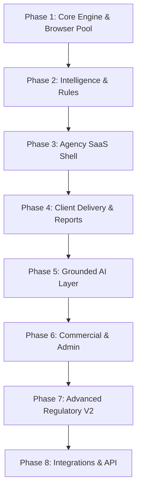

# dev-doc2 — Modular Feature Development & Implementation System

> **Continuous Privacy & Consent Monitoring for Digital Web Agencies**  
> **Source of Truth:** [`PLAN.md`](../PLAN.md) (Version 2.1 Master Specification)  
> **Purpose:** Reorganizes `PLAN.md` into isolated, highly actionable, step-by-step feature modules and phases so engineering teams can implement, test, and verify each feature independently.

---

## 1. How to Use dev-doc2

* **If you are planning sprint milestones:** Follow the **[Phases](#2-development-phases--order-of-attack)** (`dev-doc2/phases/`). Phases represent the strict architectural build order.
* **If you are building a specific feature:** Open the matching **[Module Sheet](#3-modular-feature-catalog-modules)** (`dev-doc2/modules/`). Each module contains:
  1. Business Pain & User Outcome
  2. Architecture & Data Flow
  3. Database Models & Migrations
  4. API & Server Actions
  5. UI Components & Route Handlers
  6. Asynchronous Queue Jobs
  7. Step-by-Step File Checklist
  8. Given/When/Then Acceptance Criteria & Negative Tests
  9. Definition of Done (DoD)

```
dev-doc2/
├── README.md                      ← Master Index & Dependency Graph
├── 00-DEVELOPER-GUIDE.md          ← Engineering Rules, Contracts & DoD
├── phases/                        ← Build Sequence (Phase 1 to Phase 8)
│   ├── phase-01-core-engine.md
│   ├── phase-02-intelligence.md
│   ├── phase-03-agency-saas.md
│   ├── phase-04-client-delivery.md
│   ├── phase-05-grounded-ai.md
│   ├── phase-06-commercial-ops.md
│   ├── phase-07-regulatory-v2.md
│   └── phase-08-integrations.md
└── modules/                       ← 25 Granular Feature Worksheets (1-by-1 development)
    ├── 01-multi-tenant-auth.md
    ├── 02-browser-pool-orchestrator.md
    ├── 03-ssrf-guard-network-security.md
    ├── 04-consent-journeys-engine.md
    ├── 05-cmp-adapters-heuristics.md
    ├── 06-tracker-vendor-database.md
    ├── 07-deterministic-rule-engine.md
    ├── 08-privacy-drift-baselines.md
    ├── 09-dual-scoring-system.md
    ├── 10-immutable-evidence-vault.md
    ├── 11-issue-management-remediation.md
    ├── 12-agency-dashboard-attention-center.md
    ├── 13-white-label-reporting-engine.md
    ├── 14-client-portal-magic-links.md
    ├── 15-grounded-ai-layer.md
    ├── 16-stripe-billing-entitlements.md
    ├── 17-free-public-lead-scanner.md
    ├── 18-super-admin-operations.md
    ├── 19-notification-intelligence-alerts.md
    ├── 20-global-privacy-control-gpc.md
    ├── 21-cipa-wiretap-session-replay.md
    ├── 22-cname-cloaking-resolver.md
    ├── 23-policy-to-code-auditor.md
    ├── 24-public-api-webhooks.md
    └── 25-wordpress-companion-plugin.md
```

---

## 2. Development Phases & Order of Attack



| Phase | Focus Area | Key Modules | Primary Deliverable |
|---|---|---|---|
| **Phase 1: Core Engine** | Browser Automation & Security | M02, M03, M04 | Deterministic Playwright crawler running 4–6 journeys with SSRF protection |
| **Phase 2: Intelligence** | Detection & Rules | M05, M06, M07, M08, M09 | CMP detection, 50 rules, Privacy Drift diffing, Dual Scoring engine |
| **Phase 3: Agency SaaS** | Tenancy & Dashboard | M01, M10, M11, M12 | Clerk org mapping, multi-tenant isolation, portfolio dashboard, issue triage |
| **Phase 4: Client Delivery** | Reports & Client Portal | M13, M14, M19 | 5 white-label PDF/HTML reports, passwordless magic-link client portal |
| **Phase 5: Grounded AI** | Evidence-Linked LLM | M15 | Explanations, client message generator, fix recipes, token budget breakers |
| **Phase 6: Commercial & Ops** | Revenue & Governance | M16, M17, M18 | Stripe multi-currency billing, free public lead scanner, 15-view admin console |
| **Phase 7: Regulatory V2** | US & Advanced Enforcement | M20, M21, M22, M23 | GPC opt-outs, CIPA session replay, CNAME de-anonymization, policy reconciliation |
| **Phase 8: Integrations** | Automation & Platform | M24, M25 | REST API, HMAC outbound webhooks, Slack/Jira sync, WordPress plugin |

---

## 3. Modular Feature Catalog (`modules/`)

Every feature module is self-contained with exact file paths, schema contracts, and tests:

| Module | Title | Tier | Description |
|---|---|---|---|
| **[M01](modules/01-multi-tenant-auth.md)** | Multi-Tenant Auth & Tenancy | MVP | Clerk Core 3 auth, `forAgency(agencyId)` Prisma extension, RBAC roles |
| **[M02](modules/02-browser-pool-orchestrator.md)** | Browser Pool & Orchestration | MVP | Playwright Chromium lifecycle, 50-use recycling, context isolation |
| **[M03](modules/03-ssrf-guard-network-security.md)** | SSRF Guard & Network Isolation | MVP | Port allowlist, DNS pre-check, IP pinning, per-hop redirect guard |
| **[M04](modules/04-consent-journeys-engine.md)** | Consent Journeys Engine | MVP | NO_CONSENT, REJECT_ALL, ACCEPT_ALL, WITHDRAW, GPC, INTERACTION |
| **[M05](modules/05-cmp-adapters-heuristics.md)** | CMP Adapters & Heuristics | MVP | Usercentrics, Cookiebot, OneTrust, Complianz, Didomi, Shadow DOM |
| **[M06](modules/06-tracker-vendor-database.md)** | Tracker Vendor Intelligence | MVP | 2,500+ vendor catalog, domain patterns, unknown vendor triage |
| **[M07](modules/07-deterministic-rule-engine.md)** | Deterministic Rule Engine | MVP | 50 rules (`PDM-R001`–`PDM-R050`), jurisdiction profiles |
| **[M08](modules/08-privacy-drift-baselines.md)** | Privacy Drift & Baselines | MVP | Baseline approval lifecycle, longitudinal diffing, maintenance mode |
| **[M09](modules/09-dual-scoring-system.md)** | Dual Scoring System | MVP | Technical Monitoring Score (0–100) vs. Scan Confidence Index (0–100%) |
| **[M10](modules/10-immutable-evidence-vault.md)** | Evidence Vault & Redaction | MVP | Timestamped HTTP records, S3 screenshots, PII header/form sanitization |
| **[M11](modules/11-issue-management-remediation.md)** | Issue Lifecycle & Verification | MVP | NEW → RESOLVED → VERIFIED, GTM auto-fix recipes, re-scan verification |
| **[M12](modules/12-agency-dashboard-attention-center.md)**| Portfolio Attention Center | MVP | Portfolio rollup, website management, urgent triage cards |
| **[M13](modules/13-white-label-reporting-engine.md)** | White-Label Reporting Engine | MVP | 5 report types, custom branding, async PDF compilation in S3 |
| **[M14](modules/14-client-portal-magic-links.md)** | Client Portal & Magic Links | MVP | Passwordless token auth (`/portal/*`), read-only client experience |
| **[M15](modules/15-grounded-ai-layer.md)** | Grounded AI & Safety Preambles | V1 | `evidence_refs` validation, 3-tier model routing, SHA-256 caching |
| **[M16](modules/16-stripe-billing-entitlements.md)** | Stripe Billing & Entitlements | MVP | 4 tiers, USD/GBP/EUR, 9-point entitlement checks, read-only mode |
| **[M17](modules/17-free-public-lead-scanner.md)** | Free Public Scanner Lead Magnet | V1 | Turnstile verification, `scan:free` queue, lead capture gate |
| **[M18](modules/18-super-admin-operations.md)** | Super-Admin Console (15 Views) | V1 | Tenant management, queue depths, AI usage, signed impersonation |
| **[M19](modules/19-notification-intelligence-alerts.md)**| Alert Intelligence & Quiet Hours | MVP | Deduplication, maintenance window suppression, daily/weekly digests |
| **[M20](modules/20-global-privacy-control-gpc.md)** | Global Privacy Control (GPC) | V2 | `Sec-GPC: 1` verification, California/Colorado opt-out assertions |
| **[M21](modules/21-cipa-wiretap-session-replay.md)** | CIPA Wiretap & Session Replay | V2 | Hotjar/FullStory/Clarity unmasked keystroke logging detection |
| **[M22](modules/22-cname-cloaking-resolver.md)** | CNAME Cloaking Resolver | V2 | Recursive DNS resolution unmasking ad-tech behind first-party subdomains |
| **[M23](modules/23-policy-to-code-auditor.md)** | Policy-to-Code Auditor | V2 | AI comparison of published privacy policies vs. real network traffic |
| **[M24](modules/24-public-api-webhooks.md)** | Public REST API & Webhooks | V1.5 | Scoped API keys (`pdm_live_...`), HMAC-SHA256 outbound event delivery |
| **[M25](modules/25-wordpress-companion-plugin.md)** | WordPress Companion Plugin | V3 | WP-Admin badge, automatic re-scan on plugin update, domain verification |

---

## 4. The 4 Non-Negotiable Engineering Invariants

1. **Deterministic Scanner is Sovereign:** An LLM may never decide if a network request occurred or if a cookie was set.
2. **AI Grounding via Primary Keys:** Every AI output must carry `evidence_refs` matching real `IssueEvidence` IDs.
3. **Multi-Tenant Scoping at DB Layer:** Every tenant query must use `forAgency(agencyId)`. Raw Prisma queries in route handlers are banned.
4. **Terminology Compliance:** Prohibited terms (`violation`, `GDPR breach`, `illegal`, `compliant`) fail CI automatically.
