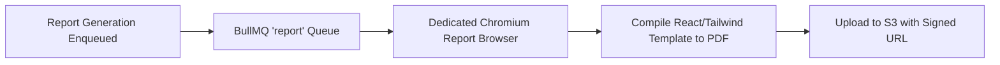

# Module 13 — White-Label Reporting Engine (5 Report Types)

> **Tier:** MVP · **Package:** `@pdm/reports`, `worker`  
> **Status:** ✅ Complete & Verified

---

## 1. Objective & Business Pain
Agencies sell care plans to clients. To justify recurring retainers, agencies must provide high-quality, branded PDF reports that document ongoing privacy monitoring and score improvements.

## 2. Architecture & The 5 Report Types
1. **Scan Summary Report:** Complete technical breakdown of a single scan run.
2. **Issue Deep-Dive Report:** Technical finding records with raw evidence for developers.
3. **Monthly Executive Monitoring Report:** Non-technical summary highlighting uptime and care plan value.
4. **Website Health & Trend Report:** Longitudinal progress tracking score recovery.
5. **Privacy Drift Audit Report:** Chronological record of tracking changes over time.

## 3. Asynchronous PDF Pipeline

## 4. Key Files
* `packages/reports/src/templates/`: Report React templates.
* `packages/reports/src/branding.ts`: Resolves agency custom logo, primary color, and company name.
* `worker/src/jobs/report.job.ts`: Asynchronous PDF compilation worker.

## 5. Acceptance Criteria
* **Given** an agency with Growth plan and custom branding configured,
* **When** generating a Monthly Monitoring report,
* **Then** the resulting PDF contains the agency's logo and brand colors with zero Privacy Drift Monitor marks.
