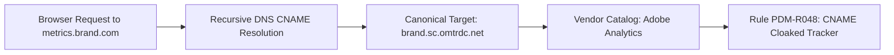

# Module 22 — CNAME Cloaking & First-Party Proxy De-Anonymization

> **Tier:** V2 · **Package:** `@pdm/scanner`, `@pdm/analysis`  
> **Status:** ✅ Core Models Defined

---

## 1. Objective & Business Pain
Ad-tech vendors evade browser ad-blockers and privacy scanners by instructing site owners to map a first-party subdomain (e.g., `metrics.brand.com`) to their servers via CNAME records. Standard scanners miss this and report it as "first-party."

## 2. Architecture & DNS De-Anonymization

## 3. Implementation Code
* Uses Node.js `dns.promises.resolveCname()` to traverse DNS alias chains.
* If a sub-domain resolves to an external tracker domain, reclassifies the request from first-party to the underlying third-party vendor.

## 4. Key Files
* `packages/scanner/src/net/cname.ts`: Recursive DNS CNAME resolver.
* `packages/analysis/src/rules/advanced.ts`: Rule `PDM-R048` trigger logic.

## 5. Acceptance Criteria
* **Given** a request to `analytics.client.com` that points via CNAME to `client.e.adroll.com`,
* **When** the network analyzer inspects the domain,
* **Then** the vendor is correctly identified as **AdRoll**,
* **And** `PDM-R048: CNAME_CLOAKING_DETECTED` is emitted.
