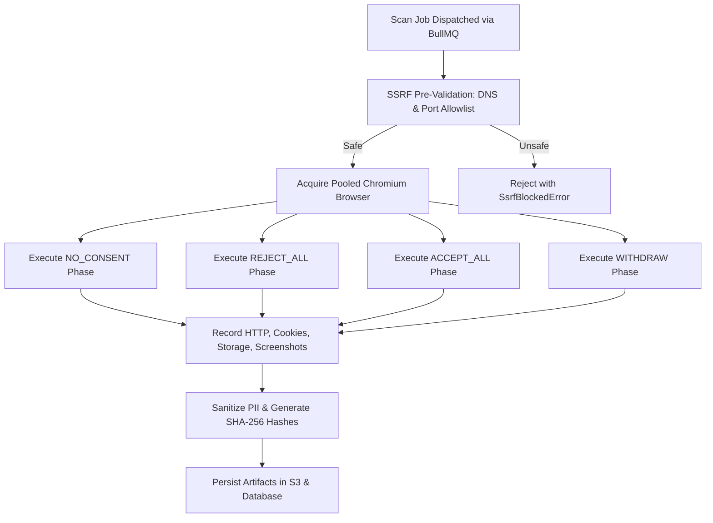

# Phase 1 — Core Scanner & Browser Automation Engine

> **Goal:** Run deterministic, multi-journey crawls against real websites in headless Playwright Chromium, with strict SSRF defense, context pooling, and immutable evidence recording.  
> **Status:** ✅ Complete & Verified (950 Tests Passing)  
> **Modules Covered:** [M02 (Browser Pool)](../modules/02-browser-pool-orchestrator.md), [M03 (SSRF Guard)](../modules/03-ssrf-guard-network-security.md), [M04 (Consent Journeys)](../modules/04-consent-journeys-engine.md), [M10 (Evidence Vault)](../modules/10-immutable-evidence-vault.md)

---

## 1. Scope & Execution Flow

---

## 2. Implementation Tasks

| # | Task | Package / Location | DoD Verification |
|---|---|---|---|
| **1.1** | Browser Pool Manager | `packages/scanner/src/browser/pool.ts` | 50-use recycling verified in `pool.test.ts` |
| **1.2** | SSRF Egress Defense | `packages/scanner/src/net/guard.ts` | Rejects metadata, loopback, private IPs in `guard.test.ts` |
| **1.3** | Per-Hop Redirect Guard | `packages/scanner/src/scan.ts` | Route handler checks redirects in `ssrf-navigation.test.ts` |
| **1.4** | Multi-Journey Drivers | `packages/scanner/src/phase-runner.ts` | Executes NO_CONSENT, REJECT_ALL, ACCEPT_ALL, WITHDRAW |
| **1.5** | Evidence Collector | `packages/scanner/src/record/evidence.ts` | Sanitizes auth headers and strips session tokens |
| **1.6** | BullMQ Scan Pipeline | `worker/src/index.ts` | Jobs process without colon errors in job IDs |

---

## 3. Acceptance Verification Checklist

- [x] Scan job finishes all 4 phases and records requests under respective consent states.
- [x] Attempts to scan `http://169.254.169.254/` or `http://localhost:5432/` fail closed with `URL_NOT_ALLOWED`.
- [x] Browsers recycle automatically after 50 context runs with zero RAM growth.
- [x] A website with a slow network completes the observation window cleanly.
