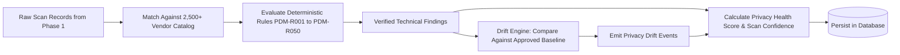

# Phase 2 — Intelligence, Rules & Privacy Drift Engine

> **Goal:** Interpret raw browser evidence through deterministic rule evaluation, vendor cataloging, longitudinal Privacy Drift diffing, and dual health/confidence scoring.  
> **Status:** ✅ Complete & Verified  
> **Modules Covered:** [M05 (CMP Adapters)](../modules/05-cmp-adapters-heuristics.md), [M06 (Tracker Catalog)](../modules/06-tracker-vendor-database.md), [M07 (Rule Engine)](../modules/07-deterministic-rule-engine.md), [M08 (Privacy Drift)](../modules/08-privacy-drift-baselines.md), [M09 (Dual Scoring)](../modules/09-dual-scoring-system.md)

---

## 1. Scope & Execution Flow



---

## 2. Implementation Tasks

| # | Task | Package / Location | DoD Verification | Status |
|---|---|---|---|---|
| **2.1** | CMP Adapter Matrix (8 Vendors) | `packages/scanner/src/consent/` | Usercentrics, Cookiebot, OneTrust, Complianz, CookieYes, Didomi, Axeptio, Klaro | ✅ Verified (39/39 tests) |
| **2.2** | Vendor Identification Engine | `packages/analysis/src/classify.ts` | Multi-signal matching (domain, script, cookie, storage, path), ReDoS-safe globs | ✅ Verified (13/13 tests) |
| **2.3** | 50 Master Deterministic Rules | `packages/analysis/src/rules/` | Evaluates `PDM-R001`–`PDM-R050` with rule precedence and jurisdiction filters | ✅ Verified (34/34 tests) |
| **2.4** | Privacy Drift Longitudinal Diff | `packages/analysis/src/drift.ts` | Normalized cookie/token diffing, filters out PARTIAL scans, emits 11 change types | ✅ Verified (15/15 tests) |
| **2.5** | Dual Scoring Architecture | `packages/analysis/src/score.ts` | Deduction model (100 base, severity caps, partial ceiling 75, mathematical proof) | ✅ Verified (10/10 tests) |

---

## 3. Acceptance Verification Checklist

- [x] **Pre-Consent Finding (`PDM-R001`):** Tracking tag detected in `NO_CONSENT` triggers Critical severity with millisecond offset.
- [x] **Reject-All Enforcement (`PDM-R011`):** Tracking tag continuing post-rejection triggers Critical regression issue.
- [x] **Zero Spurious Drift (`F28`):** Scanning the exact same page twice produces identical fingerprints and zero drift events.
- [x] **CMP Shadow DOM & Deny Support:** Usercentrics "Deny" control inside open Shadow Root is pierced and recognized.
- [x] **Partial Scan Scoring Ceiling:** A scan with unexecuted phases cannot score above 75, and confidence is marked `PARTIAL`.
- [x] **Independent Replayability:** `worker/src/analysis.ts` reads stored evidence and writes interpretations without touching raw network tables.

---

## 4. Verification Commands

```powershell
# Run all Phase 2 analysis engine tests (82 tests)
npx.cmd vitest run packages/analysis

# Run all consent adapter tests (39 tests)
npx.cmd vitest run packages/scanner/src/consent
```

