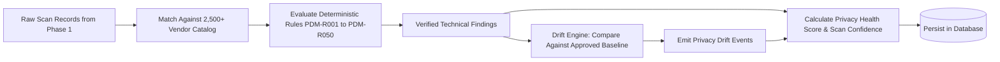

# Phase 2 — Intelligence, Rules & Privacy Drift Engine

> **Goal:** Interpret raw browser evidence through deterministic rule evaluation, vendor cataloging, longitudinal Privacy Drift diffing, and dual health/confidence scoring.  
> **Status:** ✅ Complete & Verified  
> **Modules Covered:** [M05 (CMP Adapters)](../modules/05-cmp-adapters-heuristics.md), [M06 (Tracker Catalog)](../modules/06-tracker-vendor-database.md), [M07 (Rule Engine)](../modules/07-deterministic-rule-engine.md), [M08 (Privacy Drift)](../modules/08-privacy-drift-baselines.md), [M09 (Dual Scoring)](../modules/09-dual-scoring-system.md)

---

## 1. Scope & Execution Flow

---

## 2. Implementation Tasks

| # | Task | Package / Location | DoD Verification |
|---|---|---|---|
| **2.1** | CMP Adapter Matrix | `packages/scanner/src/consent/` | Adapters for Usercentrics, Cookiebot, OneTrust, Complianz |
| **2.2** | Vendor Identification | `packages/analysis/src/tracker/` | Matches 2,500+ tracking networks by regex and script path |
| **2.3** | 50 Deterministic Rules | `packages/analysis/src/rules/` | Evaluates `PDM-R001`–`PDM-R050` across consent phases |
| **2.4** | Privacy Drift Diffing | `packages/analysis/src/drift.ts` | Detects new trackers, removed cookies, and attribute changes |
| **2.5** | Dual Scoring Math | `packages/analysis/src/score.ts` | Calculates 0–100 score and distinct 0–100% confidence |

---

## 3. Acceptance Verification Checklist

- [x] Pre-consent analytics pixel triggers `PDM-R001` with explicit millisecond offset.
- [x] Diffing two identical scans outputs zero drift events (`F28`).
- [x] An unhandled or broken banner yields an `INCONCLUSIVE` confidence state without awarding a perfect 100 score.
- [x] Usercentrics "Deny" button is properly recognized as a valid rejection control.
