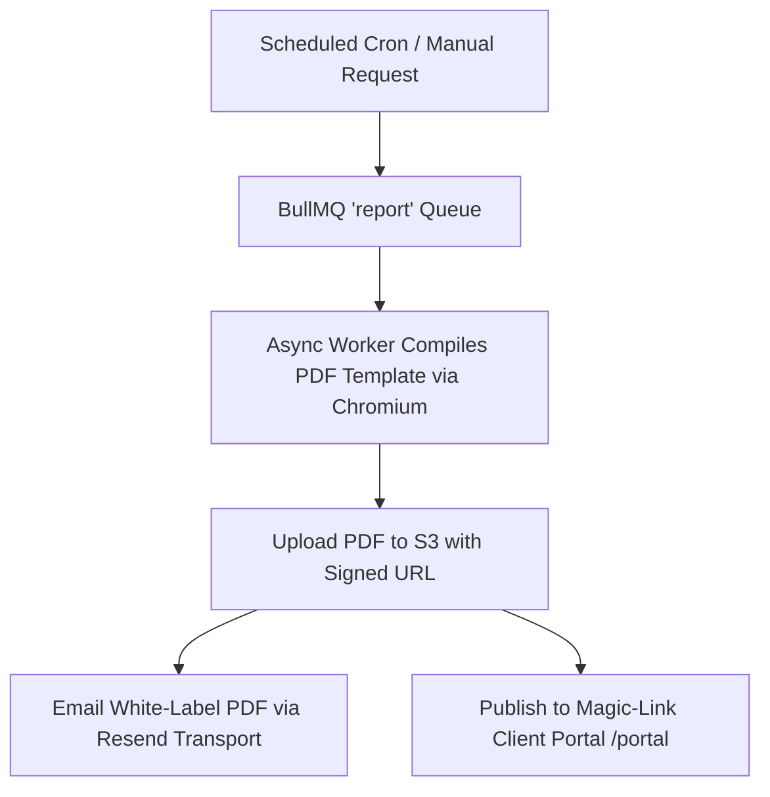

# Phase 4 — Client Delivery, White-Labeling & Reports

> **Goal:** Enable agencies to turn monitoring into a monetizable care plan deliverable through 5 white-label PDF/HTML report types, custom branding, and a passwordless client portal.  
> **Status:** ✅ Complete & Verified  
> **Modules Covered:** [M13 (White-Label Reports)](../modules/13-white-label-reporting-engine.md), [M14 (Client Portal)](../modules/14-client-portal-magic-links.md), [M19 (Notification Alerts)](../modules/19-notification-intelligence-alerts.md)

---

## 1. Scope & Execution Flow



---

## 2. Implementation Tasks

| # | Task | Package / Location | DoD Verification | Status |
|---|---|---|---|---|
| **4.1** | Asynchronous Report Worker | `worker/src/jobs/report.job.ts` | BullMQ `report` queue, atomic `markGenerating` state guard, S3 storage under tenant prefix | ✅ Verified |
| **4.2** | 5 Master Report Templates | `packages/reports/src/templates/` | Scan, Issue, Monthly Monitoring, Website Health, and Privacy Drift reports | ✅ Verified |
| **4.3** | White-Label Branding Resolver | `packages/reports/src/branding.ts` | Entitlement-checked (`whiteLabel` feature tier), agency-keyed cache, snapshotting on report row | ✅ Verified (19/19 tests) |
| **4.4** | Passwordless Client Portal | `src/server/portal/` | 32-byte SHA-256 tokens, 15-min single-use magic links, anti-enumeration 204 responses, no Clerk dependency | ✅ Verified (14/14 tests) |
| **4.5** | Resend Email & Alert Pipeline | `packages/email/`, `packages/notifications/` | RFC 5322 From parser, permanent vs. transient error split (`EmailRejectedError`), quiet hours & digests | ✅ Verified (96/96 tests) |

---

## 3. Acceptance Verification Checklist

- [x] **White-Label Entitlement Enforcement:** White-label branding is resolved centrally through `@pdm/billing`; plans without white-label entitlement strictly fall back to platform default branding.
- [x] **Branding Immutability:** Generated reports snapshot branding at creation time so future branding updates never alter historical client documents.
- [x] **Client Portal Data Isolation:** Portal sessions resolve `clientId` + `agencyId` and are strictly barred from agency configuration routes or other clients' websites.
- [x] **Anti-Enumeration Magic Links:** Submitting an uninvited email address returns HTTP 204 No Content without leaking user existence.
- [x] **Permanent Email Failure Split:** Deterministic email rejections (400, 401, 403, 404, 422) throw `EmailRejectedError` and fail immediately instead of wasting 8 retries over 2 hours.
- [x] **Quiet Hours & Alert Digests:** Notifications respect agency working hours and group multi-finding scans into a single consolidated email.

---

## 4. Verification Commands

```powershell
# Run all Phase 4 report, branding, portal, email, and notification tests (129 tests)
npx.cmd vitest run packages/reports packages/email packages/notifications src/server/portal

# Run terminology verification
npm.cmd run check:terminology

# Run linter
npm.cmd run lint
```

