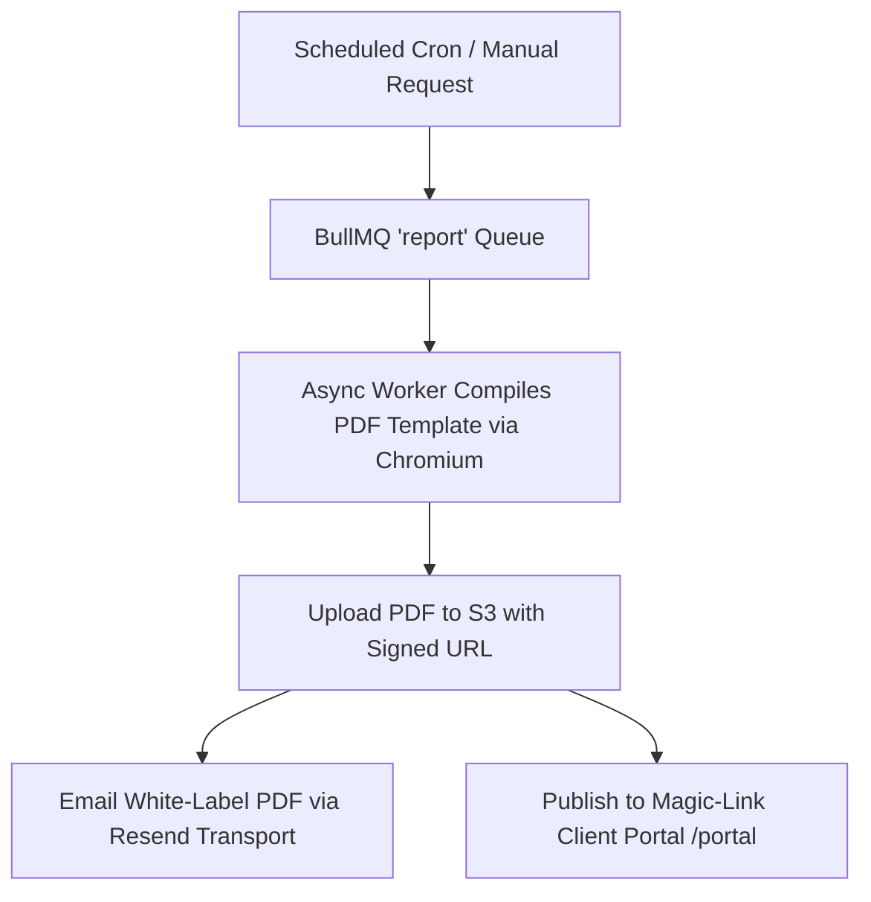

# Phase 4 — Client Delivery, White-Labeling & Reports

> **Goal:** Enable agencies to turn monitoring into a monetizable care plan deliverable through 5 white-label PDF/HTML report types, custom branding, and a passwordless client portal.  
> **Status:** ✅ Complete & Verified  
> **Modules Covered:** [M13 (White-Label Reports)](../modules/13-white-label-reporting-engine.md), [M14 (Client Portal)](../modules/14-client-portal-magic-links.md), [M19 (Notification Alerts)](../modules/19-notification-intelligence-alerts.md)

---

## 1. Scope & Execution Flow

---

## 2. Implementation Tasks

| # | Task | Package / Location | DoD Verification |
|---|---|---|---|
| **4.1** | Report Compilation Worker | `worker/src/jobs/report.job.ts` | Generates PDF asynchronously without blocking web tier |
| **4.2** | 5 Report Templates | `packages/reports/src/templates/` | Scan, Issue, Monthly, Health, and Drift reports |
| **4.3** | White-Label Branding Resolver | `packages/reports/src/branding.ts` | Replaces PDM logo/colors with agency assets |
| **4.4** | Client Portal Magic Links | `src/server/portal/` | 14-day signed tokens; non-Clerk session handling |
| **4.5** | Resend Email Transport | `packages/email/src/` | Verified delivery with RFC 5322 From headers |

---

## 3. Acceptance Verification Checklist

- [x] White-label branding strictly obeys the agency's subscription entitlement tier.
- [x] Client portal sessions are read-only and cannot reach agency settings or other clients.
- [x] Monthly monitoring PDF renders cleanly in Adobe Acrobat, Chrome, and Apple Preview.
- [x] Bounced email addresses trigger automatic delivery suppression.
