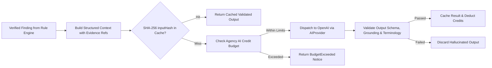

# Phase 5 — Grounded AI Architecture & Safety

> **Goal:** Deploy an evidence-grounded AI explanation and client-messaging layer that translates raw technical findings into plain English without hallucinations or legal overclaims.  
> **Status:** ✅ Complete & Live-Verified (OpenAI standard & advanced tiers tested)  
> **Modules Covered:** [M15 (Grounded AI Layer)](../modules/15-grounded-ai-layer.md)

---

## 1. Scope & Execution Flow

---

## 2. Implementation Tasks

| # | Task | Package / Location | DoD Verification |
|---|---|---|---|
| **5.1** | `AIProvider` Abstraction | `packages/ai/src/providers/` | Supports OpenAI and Mock provider for testing |
| **5.2** | Grounding Validator | `packages/ai/src/validate.ts` | Asserts `evidence_refs` resolve to real DB IDs |
| **5.3** | Terminology Validator | `packages/ai/src/validate.ts` | Rejects forbidden words (`violation`, `GDPR breach`) |
| **5.4** | Token Estimator & Budget | `packages/ai/src/budget.ts` | Halts requests when agency quota is exhausted |
| **5.5** | Prompt Versioning | `packages/ai/src/prompts/` | Enforces `<FEATURE>_V<n>` naming contracts |

---

## 3. Acceptance Verification Checklist

- [x] AI output containing an imaginary evidence ID is rejected at the validation boundary.
- [x] Preambles successfully enforce neutral, technical terminology without legal advice assertions.
- [x] Deduplication cache serves identical findings with zero LLM API calls.
- [x] Monthly credit limits prevent uncontrolled API spend overruns.
