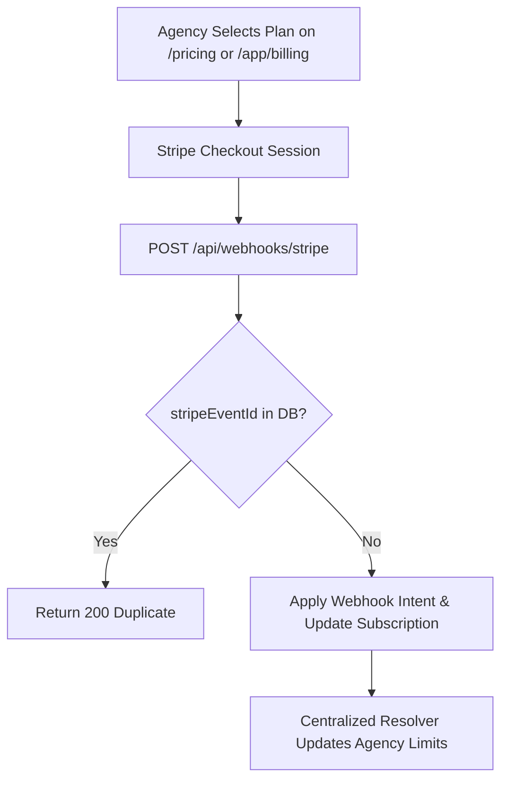

# Phase 6 — Commercial Architecture, Billing & Admin Console

> **Goal:** Deploy Stripe subscription billing across 3 currencies with idempotent webhook processing, 9-point entitlement enforcement, a public lead-gen scanner, and a 15-view super-admin console.  
> **Status:** ✅ Complete & Verified  
> **Modules Covered:** [M16 (Stripe Billing)](../modules/16-stripe-billing-entitlements.md), [M17 (Free Public Scanner)](../modules/17-free-public-lead-scanner.md), [M18 (Admin Operations)](../modules/18-super-admin-operations.md)

---

## 1. Scope & Execution Flow

---

## 2. Implementation Tasks

| # | Task | Package / Location | DoD Verification |
|---|---|---|---|
| **6.1** | Stripe Multi-Currency Catalogue | `packages/billing/src/catalogue.ts` | Fixed price points across USD, GBP, and EUR |
| **6.2** | 9-Point Entitlement Enforcement | `src/server/entitlements.ts` | Enforces website, scan, AI, and seat limits |
| **6.3** | Idempotent Webhook Handler | `src/server/services/billing-webhook.ts` | Deduplicates events and retries gracefully |
| **6.4** | Free Public Lead-Gen Scanner | `src/app/(marketing)/free-scanner/` | Isolated queue, Turnstile, lead capture gate |
| **6.5** | 15-View Super-Admin Console | `src/app/(admin)/admin/` | Queue depths, AI usage, signed impersonation |

---

## 3. Acceptance Verification Checklist

- [x] Webhooks drive entitlements; redirecting without a webhook grants no extra rights.
- [x] Replaying a Stripe webhook event is a clean, idempotent no-op.
- [x] Non-payment moves the agency to read-only scanning mode without hiding historical evidence.
- [x] Free scanner runs on an isolated queue and cannot starve paid customer scans.
- [x] Super-admin impersonation sessions expire in 30 minutes and are audit-logged against the customer.
