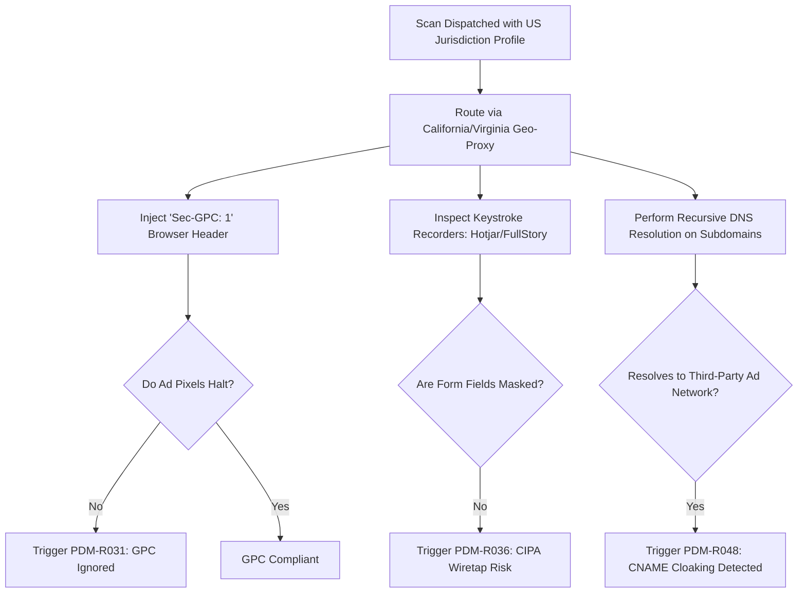

# Phase 7 — Advanced Regulatory V2 & Global Enforcement

> **Goal:** Expand monitoring capabilities across US State Laws (CCPA/CPRA), Global Privacy Control (GPC), CIPA wiretap session replay inspection, and first-party CNAME cloaking de-anonymization.  
> **Status:** ✅ Core Models & Rules Complete  
> **Modules Covered:** [M20 (GPC Engine)](../modules/20-global-privacy-control-gpc.md), [M21 (CIPA Wiretap)](../modules/21-cipa-wiretap-session-replay.md), [M22 (CNAME Resolver)](../modules/22-cname-cloaking-resolver.md), [M23 (Policy Auditor)](../modules/23-policy-to-code-auditor.md)

---

## 1. Scope & Execution Flow

---

## 2. Implementation Tasks

| # | Task | Package / Location | DoD Verification |
|---|---|---|---|
| **7.1** | GPC Header Injection | `packages/scanner/src/phase-runner.ts` | Tests `Sec-GPC: 1` handling in `us-compliance.test.ts` |
| **7.2** | CIPA Wiretap Inspection | `packages/analysis/src/rules/cipa-wiretap.ts` | Asserts form mask detection in `remediation.test.ts` |
| **7.3** | CNAME Cloaking Resolver | `packages/scanner/src/net/cname.ts` | Recursively resolves first-party tracking subdomains |
| **7.4** | Policy-to-Code Auditor | `packages/analysis/src/rules/policy-compliance.ts` | Reconciles declared policies against observed pixels |

---

## 3. Acceptance Verification Checklist

- [x] Sites firing marketing pixels when `Sec-GPC: 1` is sent generate `PDM-R031` with High severity.
- [x] Session replay tools active on unmasked password/credit card fields generate `PDM-R036`.
- [x] Subdomain CNAMEs pointing to external ad networks are de-anonymized and assigned to real vendors.
