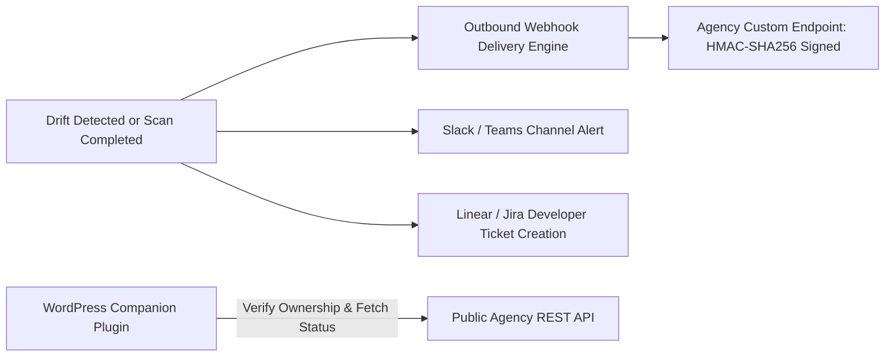

# Phase 8 — Service Integrations, Companion Plugin & Public API

> **Goal:** Extend platform reach through public agency REST APIs, outbound HMAC-SHA256 signed webhooks, real-time Slack/Teams alerts, Jira/Linear bug export, and a dedicated WordPress companion plugin.  
> **Status:** 🟡 Tiered for Fast-Follow (V1.5 / V3)  
> **Modules Covered:** [M24 (Public API & Webhooks)](../modules/24-public-api-webhooks.md), [M25 (WordPress Plugin)](../modules/25-wordpress-companion-plugin.md)

---

## 1. Scope & Execution Flow

---

## 2. Implementation Tasks

| # | Task | Tier | Package / Location | DoD Verification |
|---|---|---|---|---|
| **8.1** | Scoped API Keys | V1.5 | `packages/database/prisma/schema.prisma` | Stores hashed keys (`pdm_live_...`) with read/write scopes |
| **8.2** | Outbound Webhooks | V1.5 | `src/server/services/webhooks.ts` | HMAC-SHA256 signature and retry backoff |
| **8.3** | Slack & Teams Fan-Out | V1.5 | `packages/notifications/src/slack.ts` | Formatted channel cards for high-severity drift |
| **8.4** | Linear & Jira Sync | V1.5 | `src/server/services/integrations/` | 1-click issue export with raw evidence payload |
| **8.5** | WordPress Plugin | V3 | `plugins/wordpress/` | Displays status badge and auto-triggers re-scans |

---

## 3. Acceptance Verification Checklist

- [ ] Outbound webhooks include timestamped HMAC-SHA256 signatures in `X-PDM-Signature`.
- [ ] Failed webhook deliveries retry 5 times with exponential backoff before landing in Dead-Letter Queue.
- [ ] Public API requests require a valid Bearer token and enforce per-agency rate limits.
- [ ] WordPress companion plugin securely verifies site ownership via shared token without executing scans locally.
