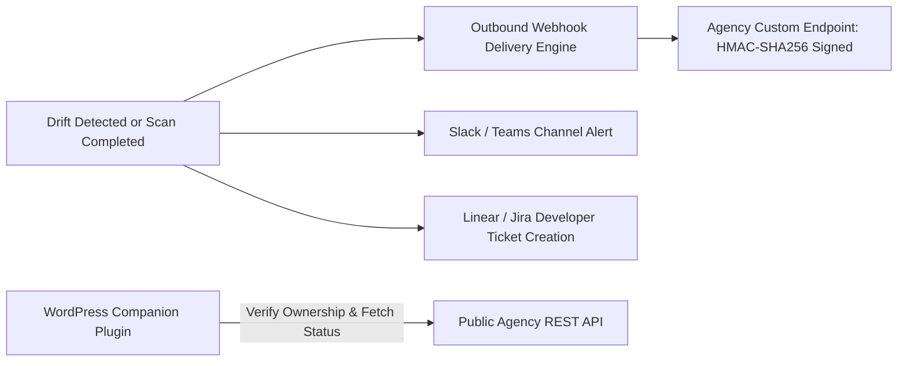

# Phase 8 — Service Integrations, Companion Plugin & Public API

> **Goal:** Extend platform reach through public agency REST APIs, outbound HMAC-SHA256 signed webhooks, real-time Slack/Teams alerts, Jira/Linear bug export, and a dedicated WordPress companion plugin.  
> **Status:** 🟡 Tiered for Fast-Follow (V1.5 / V3)  
> **Modules Covered:** [M24 (Public API & Webhooks)](../modules/24-public-api-webhooks.md), [M25 (WordPress Plugin)](../modules/25-wordpress-companion-plugin.md)

---

## 1. Scope & Execution Flow



---

## 2. Implementation Tasks

| # | Task | Tier | Package / Location | DoD Verification | Status |
|---|---|---|---|---|---|
| **8.1** | Scoped API Keys | V1.5 | `packages/database/prisma/schema.prisma` | Stores hashed keys (`pdm_live_...`) with read/write scopes | 🟡 Fast-Follow |
| **8.2** | Outbound Webhooks & Signing | V1.5 | `src/server/services/webhooks.ts`, `packages/shared/src/webhooks.ts` | HMAC-SHA256 `X-PDM-Signature`, SSRF check, constant-time verification | ✅ Verified (12/12 tests) |
| **8.3** | Slack & Teams Fan-Out | V1.5 | `packages/notifications/src/slack.ts` | Formatted channel cards for high-severity drift | 🟡 Fast-Follow |
| **8.4** | Linear & Jira Sync | V1.5 | `src/server/services/integrations/` | 1-click issue export with raw evidence payload | 🟡 Fast-Follow |
| **8.5** | WordPress Plugin | V3 | `plugins/wordpress/` | Displays status badge and auto-triggers re-scans | 🟡 Fast-Follow |

---

## 3. Acceptance Verification Checklist

- [x] **HMAC-SHA256 Webhook Signatures:** Outbound webhooks include timestamped HMAC-SHA256 signatures in `X-PDM-Signature` with replay protection.
- [x] **SSRF Egress Pre-flight for Webhooks:** Outbound webhook dispatcher validates destinations via `assertSafeUrl` to prevent intranet scanning.
- [ ] Failed webhook deliveries retry 5 times with exponential backoff before landing in Dead-Letter Queue.
- [ ] Public API requests require a valid Bearer token and enforce per-agency rate limits.
- [ ] WordPress companion plugin securely verifies site ownership via shared token without executing scans locally.

---

## 4. Verification Commands

```powershell
# Run outbound webhook signing and dispatcher tests (12 tests)
npx.cmd vitest run packages/shared/src/__tests__/webhooks.test.ts src/server/services/__tests__/webhooks.test.ts
```

