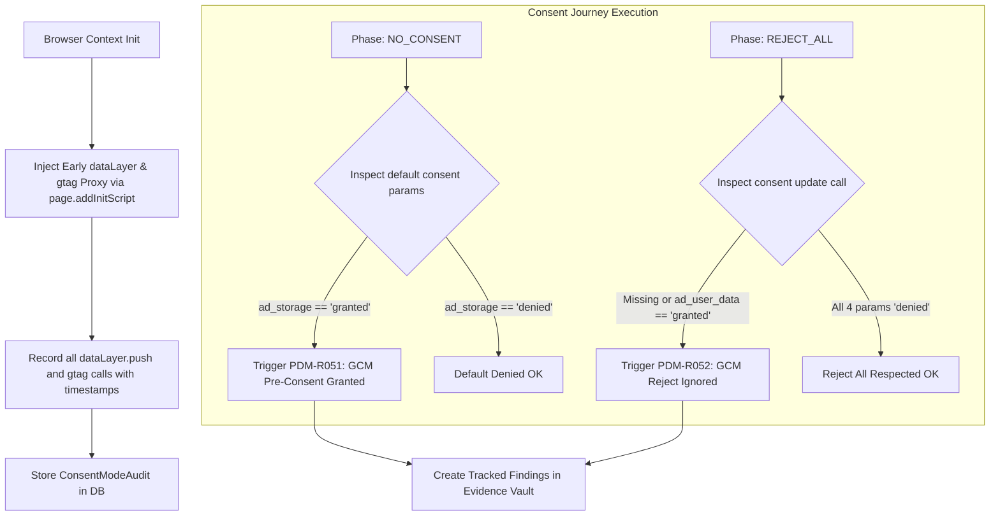

# Phase 13 — Google Consent Mode v2 & `dataLayer` Instrumentation Engine

> **Goal:** Intercept and audit Google Consent Mode v2 signals (`ad_storage`, `analytics_storage`, `ad_user_data`, `ad_personalization`) and `dataLayer` push events across all consent journeys to detect misconfigurations and unconsented pre-consent tracking.  
> **Status:** ✅ Completed  
> **Target Packages:** `packages/scanner`, `packages/analysis`, `packages/database`

---

## 1. Scope & Execution Architecture

Google Consent Mode v2 mandates that Google tags (GA4, Google Ads, Floodlight) dynamically adjust their storage and data transmission based on consent status. Many websites misconfigure GTM: tags default to `granted` before consent, or banners fail to dispatch `consent`, `'update'` events when a visitor clicks "Reject All".



---

## 2. Database Schema Extension

Add the `ConsentModeAudit` model to [`packages/database/prisma/schema.prisma`](file:///d:/ABUHASAN/WEB/Privacy-Drift-Monitor/packages/database/prisma/schema.prisma):

```prisma
model ConsentModeAudit {
  id                    String   @id @default(uuid())
  agencyId              String
  scanId                String   @unique
  isConsentModeDetected Boolean  @default(false)
  preConsentAdStorage   String?  // 'denied' | 'granted'
  preConsentAnalytics   String?  // 'denied' | 'granted'
  postRejectAdStorage   String?
  postRejectAnalytics   String?
  postRejectUserData    String?
  postRejectPersonalize String?
  violationsDetected    String[] // ["PDM-R051", "PDM-R052"]
  rawEvents             Json?    // Array of recorded consent calls
  createdAt             DateTime @default(now())

  agency                Agency   @relation(fields: [agencyId], references: [id], onDelete: Cascade)
  scan                  Scan     @relation(fields: [scanId], references: [id], onDelete: Cascade)
  
  @@index([agencyId])
  @@map("consent_mode_audits")
}
```

Add reverse relation on `Scan`:
```prisma
consentModeAudit ConsentModeAudit?
```

---

## 3. Implementation Tasks

| # | Task | File / Path | Description |
|---|---|---|---|
| **13.1** | Browser Early Init-Script | `packages/scanner/src/instrumentation/consent-mode.ts` | Early JS proxy hooking `window.dataLayer.push` and `window.gtag('consent', ...)` before any page script executes. |
| **13.2** | Context Registration | `packages/scanner/src/phase-runner.ts` | Call `page.addInitScript(CONSENT_MODE_INSTRUMENTATION_SCRIPT)` inside `runPhase`. |
| **13.3** | Fact Extraction | `packages/scanner/src/scan.ts` | Evaluate `window.__pdm_consent_events` at end of each phase and store in `ScanResult.consentModeFacts`. |
| **13.4** | Prisma Migration | `packages/database/prisma/migrations/` | Run `npm run db:migrate` creating `consent_mode_audits` table. |
| **13.5** | Rule Implementation `PDM-R051` | `packages/analysis/src/rules/consent-mode.ts` | Flags sites where `ad_storage` or `analytics_storage` defaults to `'granted'` prior to user consent. |
| **13.6** | Rule Implementation `PDM-R052` | `packages/analysis/src/rules/consent-mode.ts` | Flags sites where "Reject All" fails to dispatch `'denied'` for `ad_user_data` or `ad_personalization`. |
| **13.7** | Rule Registry Wiring | `packages/analysis/src/rules.ts` | Register R051 and R052 in `SCAN_RULES` and add to rule catalogue. |
| **13.8** | UI Audit Card | `src/components/scans/consent-mode-card.tsx` | Visual component in scan detail showing Google Consent Mode v2 status badge & parameter matrix. |

---

## 4. Key Code Snippet: Early Init-Script

```ts
// packages/scanner/src/instrumentation/consent-mode.ts
export const CONSENT_MODE_INIT_SCRIPT = `
(() => {
  window.__pdm_consent_events = window.__pdm_consent_events || [];
  
  const record = (source, type, data) => {
    try {
      window.__pdm_consent_events.push({
        source,
        type,
        data: JSON.parse(JSON.stringify(data)),
        timestamp: Date.now()
      });
    } catch (_) {}
  };

  // Intercept window.dataLayer
  let dl = window.dataLayer || [];
  window.dataLayer = new Proxy(dl, {
    set(target, prop, val) {
      if (prop === 'push' || !isNaN(prop)) {
        record('dataLayer', 'push', val);
      }
      return Reflect.set(target, prop, val);
    }
  });

  // Intercept window.gtag
  const origGtag = window.gtag;
  window.gtag = function(...args) {
    if (args[0] === 'consent') {
      record('gtag', args[1], args[2] || {});
    }
    if (typeof origGtag === 'function') {
      return origGtag.apply(this, args);
    }
  };
})();
`;
```

---

## 5. Acceptance Criteria & Test Specifications

- [x] **Pre-Consent Granted Flagged:** A site that calls `gtag('consent', 'default', { ad_storage: 'granted' })` on page load triggers `PDM-R051` (**Severity: Critical**).
- [x] **Pre-Consent Denied Clean:** A site that properly sets `'denied'` for all four parameters generates no potential issues.
- [x] **Reject All Verified:** After clicking "Reject All", the scanner verifies that `gtag('consent', 'update', ...)` was called. If missing, triggers `PDM-R052` (**Severity: High**).
- [x] **Evidence Lineage:** The `IssueEvidence` stores the exact raw event sequence captured from `__pdm_consent_events`.

---

## 6. Verification Commands

```powershell
# 1. Run scanner consent mode unit tests
npx.cmd vitest run packages/scanner/src/__tests__/consent-mode.test.ts

# 2. Run analysis rules R051 & R052 tests
npx.cmd vitest run packages/analysis/src/__tests__/rules-consent-mode.test.ts

# 3. Master gate
npm run verify
```
