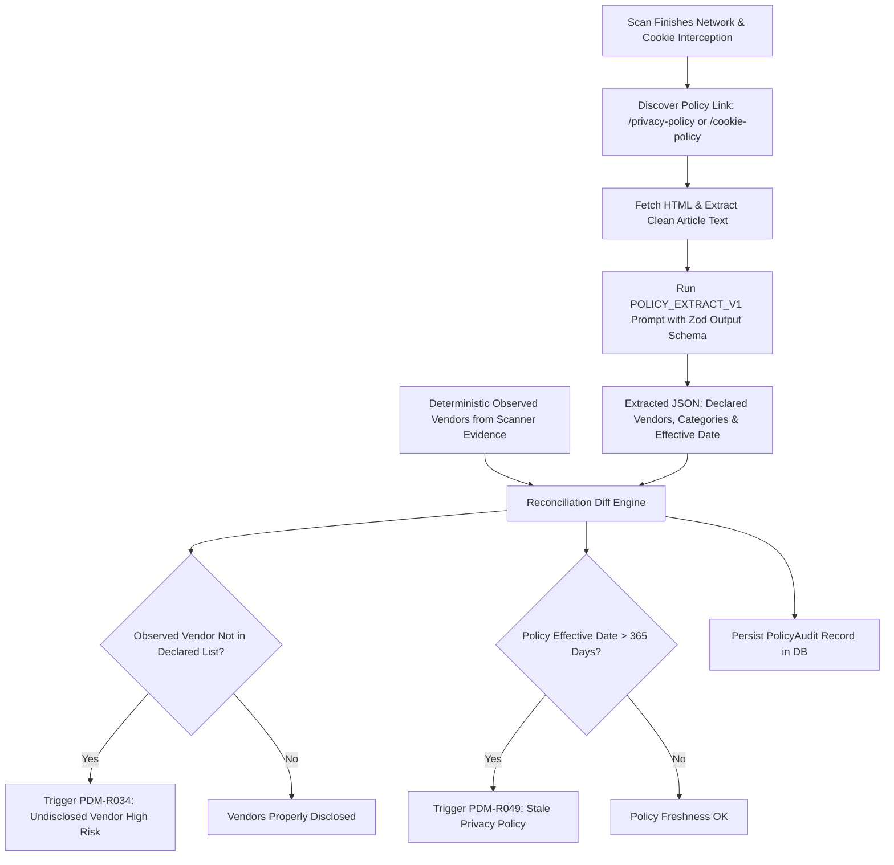

# Phase 14 — Policy-to-Code NLP Engine (Module 23 Activation)

> **Goal:** Build an automated pipeline that spiders a target website's Privacy Policy, extracts declared vendors and retention claims using grounded LLM parsing, reconciles them against observed network requests, and activates dormant rules `PDM-R034` and `PDM-R049`.  
> **Status:** 🟢 Complete  
> **Target Packages:** `packages/scanner`, `packages/ai`, `packages/analysis`, `packages/database`, `worker`

---

## 1. Scope & Execution Flow

Under **FTC Act Section 5** (Unfair or Deceptive Practices) and **CCPA**, companies face immense legal liability if their public Privacy Policy declares *"We never share your personal data with third-party advertising partners"*, while live technical audits reveal active Meta, TikTok, or Google remarketing pixels.



---

## 2. Database Schema Alignment

The `PolicyAudit` model already exists in [`packages/database/prisma/schema.prisma`](file:///d:/ABUHASAN/WEB/Privacy-Drift-Monitor/packages/database/prisma/schema.prisma):

```prisma
model PolicyAudit {
  id                 String          @id @default(uuid())
  agencyId           String
  websiteId          String
  scanId             String
  policyUrl          String
  effectiveDate      DateTime?
  declaredVendors    String[]
  detectedVendors    String[]
  undisclosedVendors String[]
  staleVendors       String[]
  complianceScore    Int             // 0 - 100
  createdAt          DateTime        @default(now())

  website            Website         @relation(fields: [websiteId], references: [id], onDelete: Cascade)
  scan               Scan            @relation(fields: [scanId], references: [id], onDelete: Cascade)
  @@index([agencyId])
  @@index([websiteId, createdAt(sort: Desc)])
  @@map("policy_audits")
}
```

---

## 3. Implementation Tasks

| # | Task | File / Path | Description |
|---|---|---|---|
| **14.1** | Policy Link Discovery | `packages/scanner/src/policy/discovery.ts` | Finds `/privacy-policy`, `/cookie-policy`, `/data-privacy` from DOM footer `<a>` tags or common URL paths. |
| **14.2** | Clean Text Extractor | `packages/scanner/src/policy/extractor.ts` | Strips navigation menus, headers, footers, scripts, leaving clean markdown/text content. |
| **14.3** | Extraction Prompt `POLICY_EXTRACT_V1` | `packages/ai/src/prompts/policy-extract.ts` | Versioned prompt extracting declared vendors, date, and data categories into a validated Zod schema. |
| **14.4** | Policy Worker Job | `worker/src/jobs/policy-audit.job.ts` | Background job orchestrating extraction, LLM parsing, diffing, and database persistence. |
| **14.5** | Un-dormant Rule `PDM-R034` | `packages/analysis/src/rules/policy-compliance.ts` | Remove from `DORMANT_RULE_IDS` in `rules.ts`. Evaluates `context.policy.undisclosedVendors`. |
| **14.6** | Un-dormant Rule `PDM-R049` | `packages/analysis/src/rules/policy-compliance.ts` | Remove from `DORMANT_RULE_IDS` in `rules.ts`. Evaluates `effectiveDate` age > 365 days. |
| **14.7** | Policy Audit UI Surface | `src/app/(app)/app/websites/[id]/policy/page.tsx` | Dedicated tab in Website detail displaying declared vs. detected vendors, undisclosed trackers, and freshness date. |

---

## 4. Prompt Specification: `POLICY_EXTRACT_V1`

```ts
// packages/ai/src/prompts/policy-extract.ts
import { z } from 'zod';

export const PolicyExtractOutputSchema = z.object({
  effectiveDate: z.string().nullable().describe('ISO date or declared effective date string if found'),
  declaredVendors: z.array(z.string()).describe('Normalized names of advertising, analytics, or tracking vendors explicitly named'),
  declaredCategories: z.array(z.string()).describe('Categories of data collected (e.g. Analytics, Marketing, Functional)'),
  optOutInstructionsFound: z.boolean().describe('Whether the policy provides instructions on how to opt out')
});

export const POLICY_EXTRACT_V1 = {
  version: 'POLICY_EXTRACT_V1',
  systemPrompt: `You are a strict compliance document auditor. Your job is to extract third-party vendors, analytics networks, and effective dates from legal Privacy Policy text.
Do NOT invent vendors that are not explicitly stated in the document.
Normalize vendor names to their canonical company or product names (e.g. "Google Analytics", "Meta Pixel", "Hotjar", "TikTok").
Output strictly structured JSON matching the provided schema.`,
  outputSchema: PolicyExtractOutputSchema
};
```

---

## 5. Acceptance Criteria & Test Specifications
 
- [x] **Policy Discovery Works:** For pages with a standard footer link `<a href="/privacy">Privacy Policy</a>`, the crawler correctly identifies and extracts the target URL.
- [x] **LLM Grounding Guaranteed:** The extractor only outputs vendors actually present in the text (verified by exact string substring search).
- [x] **PDM-R034 Triggers on Ghost Trackers:** If Meta Pixel is firing in network recordings but missing from `declaredVendors`, rule `PDM-R034` fires with **Severity: High** and links the request evidence.
- [x] **PDM-R049 Triggers on Stale Date:** If the extracted date is older than 365 days from `scan.createdAt`, `PDM-R049` triggers with **Severity: Info**.
- [x] **Dormant Rules Zeroed:** `DORMANT_RULE_IDS` in `rules.ts` is reduced from 2 to 0.

---

## 6. Verification Commands

```powershell
# 1. Run policy extraction unit and prompt tests
npx.cmd vitest run packages/ai/src/__tests__/policy-extract.test.ts

# 2. Run policy-to-code rule evaluation tests
npx.cmd vitest run packages/analysis/src/__tests__/rules-policy.test.ts

# 3. Master gate
npm run verify
```
