# Phase 16 — Public REST API v1 & Outbound Webhooks Mesh (Module 24)

> **Goal:** Expose an agency-grade Public REST API (`/api/v1/*`) secured by scoped API keys and an outbound webhook engine featuring HMAC-SHA256 signatures, exponential backoff retries, dead-letter queuing, and real-time Slack/Discord alerts.  
> **Status:** 🟡 Ready for Dev  
> **Target Packages:** `src/app/api/v1`, `packages/database`, `worker`

---

## 1. Scope & System Architecture

Digital agencies need programmatic control to integrate Privacy Drift Monitor into internal agency dashboards, CI/CD deployment pipelines, Slack incident channels, and workflow automation tools (Zapier, Make, n8n).

```mermaid
flowchart TD
  subgraph Public REST API v1
    ClientApp[Agency CI/CD or Zapier] -->|Bearer pdm_live_xyz| AuthMiddleware[API Key Hash Auth & Rate Limiter]
    AuthMiddleware --> Routes{API Route Matching}
    Routes -->|POST /api/v1/websites/:id/scans| TriggerScan[Enqueue High-Priority Scan Job]
    Routes -->|GET /api/v1/scans/:id| FetchScan[Return Scan Status & Issues JSON]
    Routes -->|GET /api/v1/reports/:id/download| DownloadPDF[Stream Signed Report PDF]
  end

  subgraph Outbound Webhook Delivery Engine
    ScanDone[Scan Complete / Drift Detected] --> WebhookProducer[Dispatch Event to BullMQ Webhook Queue]
    WebhookProducer --> Worker[Dedicated Webhook Worker]
    Worker --> Sign[Compute HMAC-SHA256 X-PDM-Signature]
    Sign --> Dispatch[HTTP POST to Registered Endpoint]
    Dispatch --> Result{Success 2xx?}
    Result -->|No| Retry[Exponential Backoff 5 Retries]
    Retry -->|Max Retries Exceeded| DLQ[Log in Dead Letter Queue Table]
    Result -->|Yes| LogSuccess[Record WebhookDelivery Status: SUCCESS]
    
    ScanDone --> SlackRouter{Slack Configured?}
    SlackRouter -->|Yes| SlackWebhook[Post Rich Interactive Block to Slack Channel]
  end
```



---

## 2. Database Schema Extensions

Add the `ApiKey`, `WebhookEndpoint`, and `WebhookDelivery` models to [`packages/database/prisma/schema.prisma`](file:///d:/ABUHASAN/WEB/Privacy-Drift-Monitor/packages/database/prisma/schema.prisma):

```prisma
model ApiKey {
  id          String    @id @default(uuid())
  agencyId    String
  name        String
  keyPrefix   String    // e.g. "pdm_live_a1b2"
  keyHash     String    @unique // SHA-256 hash of the full secret token
  scopes      String[]  @default(["read", "write"])
  lastUsedAt  DateTime?
  expiresAt   DateTime?
  createdAt   DateTime  @default(now())

  agency      Agency    @relation(fields: [agencyId], references: [id], onDelete: Cascade)
  @@index([agencyId])
  @@map("api_keys")
}

model WebhookEndpoint {
  id          String            @id @default(uuid())
  agencyId    String
  url         String
  description String?
  secret      String            // whsec_... HMAC signing secret
  events      String[]          // e.g. ["scan.completed", "privacy_drift.detected"]
  isActive    Boolean           @default(true)
  createdAt   DateTime          @default(now())
  updatedAt   DateTime          @updatedAt

  agency      Agency            @relation(fields: [agencyId], references: [id], onDelete: Cascade)
  deliveries  WebhookDelivery[]
  @@index([agencyId])
  @@map("webhook_endpoints")
}

model WebhookDelivery {
  id          String          @id @default(uuid())
  endpointId  String
  event       String
  payload     Json
  statusCode  Int?
  durationMs  Int?
  error       String?
  attempt     Int             @default(1)
  status      DeliveryStatus  @default(PENDING)
  createdAt   DateTime        @default(now())

  endpoint    WebhookEndpoint @relation(fields: [endpointId], references: [id], onDelete: Cascade)
  @@index([endpointId, createdAt(sort: Desc)])
  @@map("webhook_deliveries")
}

enum DeliveryStatus {
  PENDING
  SUCCESS
  FAILED
}
```

---

## 3. Implementation Tasks

| # | Task | File / Path | Description |
|---|---|---|---|
| **16.1** | API Key Generator & Hasher | `src/server/services/api-keys.ts` | Generates `pdm_live_<32_random_bytes>`, hashes via SHA-256, stores prefix + hash. |
| **16.2** | API Authentication Helper | `src/server/auth/api-auth.ts` | Validates `Bearer pdm_live_...`, checks expiry, retrieves agency context. |
| **16.3** | REST Route Handlers | `src/app/api/v1/websites/route.ts`<br>`src/app/api/v1/scans/[id]/route.ts` | CRUD operations on websites, on-demand scan triggers, and evidence export. |
| **16.4** | Webhook HMAC Signer | `packages/shared/src/security/webhook-signer.ts` | Generates header `X-PDM-Signature: t=<timestamp>,v1=<hmac_sha256>`. |
| **16.5** | Webhook Queue & Worker | `worker/src/jobs/webhook.job.ts` | BullMQ worker executing HTTP POSTs with exponential retry logic (5 attempts). |
| **16.6** | Real Slack Delivery | `packages/notifications/src/slack.ts` | Replaces dormant flag with real Slack Block Kit payload delivery to incoming webhook URLs. |
| **16.7** | Agency Settings UI | `src/app/(app)/app/settings/api/page.tsx` | UI page to generate/revoke API keys and manage outbound webhook endpoints. |

---

## 4. Key Code Implementation: HMAC Webhook Dispatcher

```ts
// packages/shared/src/security/webhook-signer.ts
import crypto from 'node:crypto';

export function signWebhookPayload(payload: string, secret: string, timestamp: number = Date.now()): string {
  const signaturePayload = `${timestamp}.${payload}`;
  const hmac = crypto.createHmac('sha256', secret).update(signaturePayload).digest('hex');
  return `t=${timestamp},v1=${hmac}`;
}

export function verifyWebhookSignature(payload: string, header: string, secret: string, toleranceSeconds = 300): boolean {
  const parts = header.split(',');
  const timestampPart = parts.find((p) => p.startsWith('t='))?.slice(2);
  const sigPart = parts.find((p) => p.startsWith('v1='))?.slice(3);

  if (!timestampPart || !sigPart) return false;
  const timestamp = parseInt(timestampPart, 10);
  if (Math.abs(Date.now() - timestamp) > toleranceSeconds * 1000) return false;

  const expectedSignature = signWebhookPayload(payload, secret, timestamp).split('v1=')[1];
  return crypto.timingSafeEqual(Buffer.from(sigPart, 'hex'), Buffer.from(expectedSignature, 'hex'));
}
```

---

## 5. Acceptance Criteria & Test Specifications

- [x] **API Key Rejection:** Requests with missing or malformed `Authorization` header return HTTP 401.
- [x] **Tenant Isolation Enforced:** An API Key for Agency A cannot view or trigger scans for Agency B's websites (HTTP 404/403).
- [x] **Webhook Signature Verified:** Outbound webhook POST contains valid `X-PDM-Signature` header matching the endpoint secret.
- [x] **Exponential Backoff:** If a destination endpoint returns 500, the worker retries up to 5 times before marking the delivery as `FAILED`.
- [x] **Slack Block Delivery:** When `privacy_drift.detected` occurs, a formatted block with website URL, health score change, and issue count posts to the configured Slack channel.

---

## 6. Verification Commands

```powershell
# 1. Test API key generation & validation
npx.cmd vitest run src/server/__tests__/api-keys.test.ts

# 2. Test HMAC webhook signing & verification
npx.cmd vitest run packages/shared/src/__tests__/webhook-signer.test.ts

# 3. Test API v1 route handlers
npx.cmd vitest run src/app/api/v1/__tests__/websites-api.test.ts

# 4. Master gate
npm run verify
```
