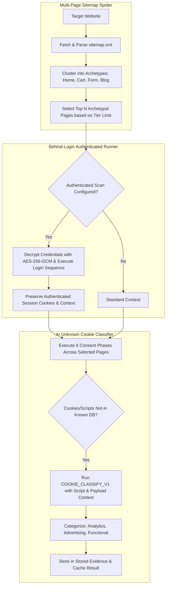

# Phase 17 — Deep Spider, Authenticated Scanning & AI Cookie Classifier

> **Goal:** Expand scanning from single-page roots into an automated multi-page sitemap spider, add form-based authenticated scanning for internal member areas, and implement an AI-powered classifier for unknown cookies and scripts.  
> **Status:** 🟡 Ready for Dev  
> **Target Packages:** `packages/scanner`, `packages/ai`, `packages/analysis`, `packages/database`

---

## 1. Scope & Execution Pipeline

Many rogue tracking pixels hide deep inside secondary pages (such as `/checkout`, `/contact-us`, or logged-in member portals) rather than the homepage. Furthermore, modern sites feature custom or obscure cookies that fail to match standard static blocklists.



---

## 2. Database Schema Extensions

Add `SitemapCrawlConfig` and `AuthenticatedScanConfig` to [`packages/database/prisma/schema.prisma`](file:///d:/ABUHASAN/WEB/Privacy-Drift-Monitor/packages/database/prisma/schema.prisma):

```prisma
model SitemapCrawlConfig {
  id              String   @id @default(uuid())
  websiteId       String   @unique
  maxPages        Int      @default(5)
  discoveredUrls  String[]
  selectedUrls    String[]
  lastCrawledAt   DateTime?
  updatedAt       DateTime @updatedAt

  website         Website  @relation(fields: [websiteId], references: [id], onDelete: Cascade)
  @@map("sitemap_crawl_configs")
}

model AuthenticatedScanConfig {
  id                String   @id @default(uuid())
  websiteId         String   @unique
  loginUrl          String
  usernameSelector  String
  passwordSelector  String
  submitSelector    String
  encryptedSecrets  String   // AES-256-GCM payload with IV and authTag
  isActive          Boolean  @default(false)
  updatedAt         DateTime @updatedAt

  website           Website  @relation(fields: [websiteId], references: [id], onDelete: Cascade)
  @@map("authenticated_scan_configs")
}
```

---

## 3. Implementation Tasks

| # | Task | File / Path | Description |
|---|---|---|---|
| **17.1** | Sitemap Parser & Spider | `packages/scanner/src/spider/sitemap.ts` | Downloads `sitemap.xml`, parses XML, categorizes URLs, and selects representative paths. |
| **17.2** | Multi-Page Phase Orchestrator | `packages/scanner/src/scan.ts` | Extends single-page loop to iterate over all selected pages while isolating session contexts. |
| **17.3** | Credential Vault & Login Runner | `packages/scanner/src/auth/login-runner.ts` | Decrypts secrets using `SCANNER_ENCRYPTION_KEY` and executes Playwright login steps. |
| **17.4** | AI Cookie Classifier Prompt | `packages/ai/src/prompts/cookie-classify.ts` | Versioned prompt `COOKIE_CLASSIFY_V1` classifying cookies from name, lifetime, domain, and stack. |
| **17.5** | Classification Worker Job | `worker/src/jobs/cookie-classifier.job.ts` | Async BullMQ job evaluating unclassified cookies and saving categories in cache. |
| **17.6** | Website Settings Multi-Page UI | `src/app/(app)/app/websites/[id]/settings/crawl/page.tsx` | Configure sitemap limits and form-based login credentials with validation. |

---

## 4. Key AI Prompt Implementation: `COOKIE_CLASSIFY_V1`

```ts
// packages/ai/src/prompts/cookie-classify.ts
import { z } from 'zod';

export const CookieClassifyOutputSchema = z.object({
  category: z.enum(['NECESSARY', 'ANALYTICS', 'ADVERTISING', 'FUNCTIONAL']),
  vendorName: z.string().describe('Identified provider or vendor, or "First Party"'),
  purpose: z.string().describe('Short 1-sentence technical explanation of what this cookie or storage key does'),
  confidence: z.number().min(0).max(1)
});

export const COOKIE_CLASSIFY_V1 = {
  version: 'COOKIE_CLASSIFY_V1',
  systemPrompt: `You are an expert web privacy and cookie taxonomist.
Given the technical attributes of a browser cookie (name, domain, expiration duration, initiating script URL, and call stack trace), identify its primary regulatory category and vendor.
Adhere to strict technical privacy standards. If the cookie is used for cross-site targeting, behavioral remarketing, or ad conversion, classify as ADVERTISING. If used for traffic metrics, classify as ANALYTICS.`,
  outputSchema: CookieClassifyOutputSchema
};
```

---

## 5. Acceptance Criteria & Test Specifications

- [ ] **Sitemap Clustering:** The sitemap parser correctly groups URLs into `HOME`, `CART`, `CHECKOUT`, `BLOG`, and `FORM` without infinite recursion.
- [ ] **Credential Security:** Credentials stored in `AuthenticatedScanConfig` cannot be decrypted without the master key `SCANNER_ENCRYPTION_KEY`. Plaintext credentials never leak into logs or API responses.
- [ ] **Authenticated Navigation:** Playwright fills login fields, waits for network idle, confirms navigation away from login URL, and passes authenticated cookies to subsequent scan phases.
- [ ] **AI Classifier Caching:** Classifying the cookie `_pk_id` returns category `ANALYTICS`, vendor `Matomo`, and caches the result so subsequent scans do not make duplicate OpenAI calls.

---

## 6. Verification Commands

```powershell
# 1. Test sitemap discovery & parsing
npx.cmd vitest run packages/scanner/src/__tests__/sitemap.test.ts

# 2. Test authenticated login runner
npx.cmd vitest run packages/scanner/src/__tests__/login-runner.test.ts

# 3. Test AI cookie classification prompt & validator
npx.cmd vitest run packages/ai/src/__tests__/cookie-classify.test.ts

# 4. Master gate
npm run verify
```
