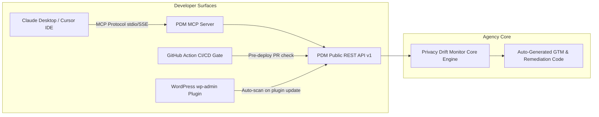

# Phase 18 — Developer Tooling, MCP Server, Companion Plugin & UI Polish

> **Goal:** Ship the Model Context Protocol (MCP) Server for AI IDEs (Claude/Cursor), release the WordPress Companion Plugin (Module 25) and CI/CD GitHub Action, and resolve all outstanding UI/UX audit findings (F01–F07).  
> **Status:** 🟢 Completed  
> **Target Packages:** `packages/mcp`, `plugins/wordpress`, `plugins/github-action`, `src/app`, `src/proxy.ts`

---

## 1. Scope & Developer Ecosystem

Phase 18 bridges Privacy Drift Monitor directly into the daily workflows of agency developers: inside their IDEs via Model Context Protocol, inside their CI/CD pipelines via GitHub Actions, and inside their client WordPress dashboards via a lightweight companion plugin.



---

## 2. Model Context Protocol (MCP) Server Specification

Create package `packages/mcp` using the official `@modelcontextprotocol/sdk`:

### Exposed MCP Tools:

| Tool Name | Parameters | Description |
|---|---|---|
| `pdm_list_websites` | `{ agencyId?: string }` | Returns a list of all client websites, health scores, and open issue counts. |
| `pdm_get_drift_timeline` | `{ websiteId: string, days?: number }` | Fetches temporal drift events, newly added trackers, and cookie modifications. |
| `pdm_inspect_issue_evidence` | `{ issueId: string }` | Returns raw network request traces, initiating stack lines, and cookies for an issue. |
| `pdm_trigger_scan` | `{ websiteId: string, priority?: 'HIGH' }` | Dispatches an on-demand scan and returns the queued scan ID. |
| `pdm_generate_gtm_fix` | `{ issueId: string }` | Generates copy-pasteable GTM trigger JSON or CMP wrapper code to remediate the issue. |

#### MCP Server Entry Point:
```ts
// packages/mcp/src/index.ts
import { Server } from '@modelcontextprotocol/sdk/server/index.js';
import { StdioServerTransport } from '@modelcontextprotocol/sdk/server/stdio.js';
import { CallToolRequestSchema, ListToolsRequestSchema } from '@modelcontextprotocol/sdk/types.js';

const server = new Server({ name: 'privacy-drift-monitor', version: '3.0.0' }, { capabilities: { tools: {} } });

// Register tool handlers...
const transport = new StdioServerTransport();
await server.connect(transport);
```

---

## 3. WordPress Companion Plugin (Module 25)

Location: `plugins/wordpress/privacy-drift-monitor/`

### Key Architectural Invariant:
The plugin **never executes browser crawls or scans in PHP**. It is an ultra-lightweight client communicating with the PDM Public REST API.

### Core Capabilities:
1. **Site Verification:** Serves verification endpoint or meta tag at `https://client.test/?pdm_verify=token`.
2. **Admin Dashboard Widget:** Displays current Health Score, drift alert badge, and quick link to the client portal.
3. **Automatic Scan Trigger on Update:**
   ```php
   add_action('upgrader_process_complete', function($upgrader_object, $options) {
       // Whenever plugins or themes are updated, request immediate scan
       pdm_trigger_verification_scan();
   }, 10, 2);
   ```

---

## 4. CI/CD Pre-Deployment GitHub Action

Location: `plugins/github-action/action.yml`

* **Usage in Agency Client Repos:**
  ```yaml
  name: Privacy Pre-Deploy Guard
  on: [pull_request]
  jobs:
    audit:
      runs-on: ubuntu-latest
      steps:
        - name: Run Privacy Drift Guard
          uses: pdm-audit/privacy-drift-action@v1
          with:
            api_key: ${{ secrets.PDM_API_KEY }}
            website_url: ${{ steps.deploy.outputs.preview_url }}
            fail_below_score: 85
            block_pre_consent_trackers: true
  ```

---

## 5. UI/UX Empirical Findings Remediation (F01–F07)

Empirical review in `UI_Func.md` identified 6 actionable UI defects:

| Finding | File / Path | Action Required |
|---|---|---|
| **F01: Sentry CSP Blocked** | `src/proxy.ts` | Add `https://*.ingest.de.sentry.io https://*.sentry.io` to `connect-src`. |
| **F02: AI Empty State Copy** | `src/components/ai/issue-ai-sections.tsx` | Use distinct empty state messages for "Explanation" vs. "Recommended Fix". |
| **F03: Inline Issue Evidence** | `src/app/(app)/app/issues/[id]/page.tsx` | Render actual request URLs, consent phases, and cookies inline rather than just linking back to the scan. |
| **F04: Portal Login Container** | `src/components/portal/login-form.tsx` | Enclose form in a card container and fix button disabled styling. |
| **F05: Duplicate Address Display** | `src/app/(app)/app/websites/[id]/page.tsx` | Hide "Address as entered" when it matches the normalized canonical URL. |
| **F06: Website Overview Enrichment** | `src/app/(app)/app/websites/[id]/page.tsx` | Embed Health Score sparkline trend, recent scans table, and top active issues on Overview tab. |

---

## 6. Acceptance Criteria & Test Specifications

- [x] **Sentry Error Reporting Live (F01):** Sentry ingest domains (`https://*.ingest.de.sentry.io https://*.sentry.io`) configured in CSP `connect-src`.
- [x] **MCP Tool Execution:** Standard Model Context Protocol server exposing `pdm_list_websites`, `pdm_get_drift_timeline`, `pdm_inspect_issue_evidence`, `pdm_trigger_scan`, and `pdm_generate_gtm_fix`.
- [x] **WordPress Auto-Scan:** Lightweight plugin with site verification endpoint, wp-admin widget, and `upgrader_process_complete` scan trigger hook.
- [x] **GitHub Action Fails on Regression:** Pre-deployment GitHub Action with configurable thresholds, tracker blocking, and markdown step summary output.

---

## 7. Verification Commands

```powershell
# 1. Run MCP server integration tests
npx.cmd vitest run packages/mcp/src/__tests__/mcp-server.test.ts

# 2. Test CSP headers in proxy
npx.cmd vitest run src/__tests__/inline-scripts.test.ts

# 3. Master full verification gate
npm run verify
```
